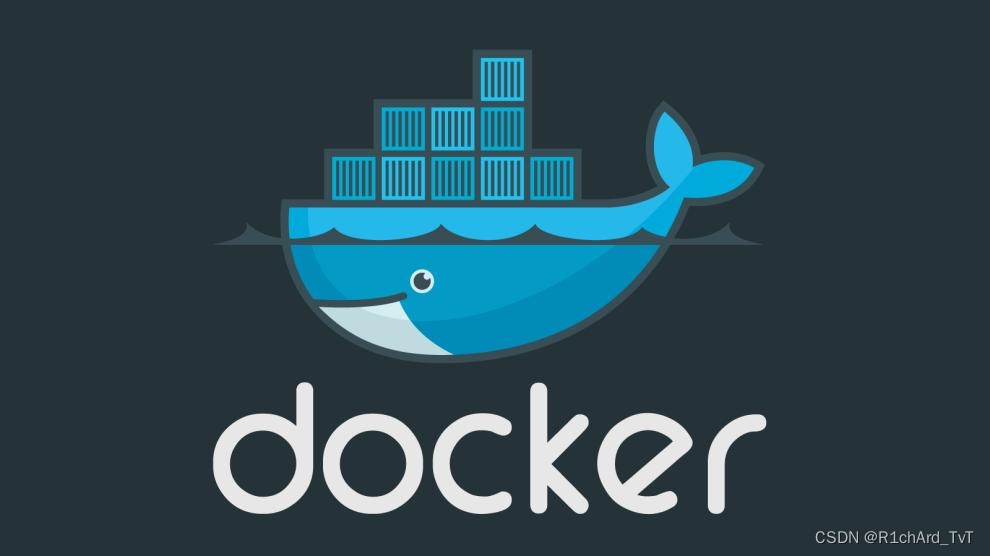
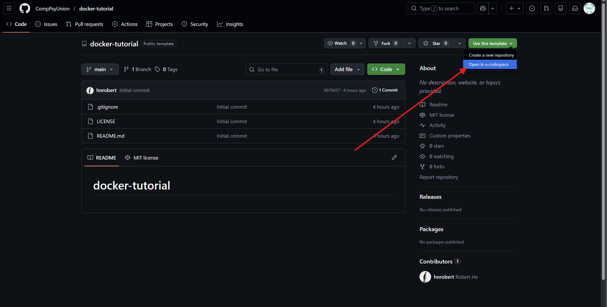
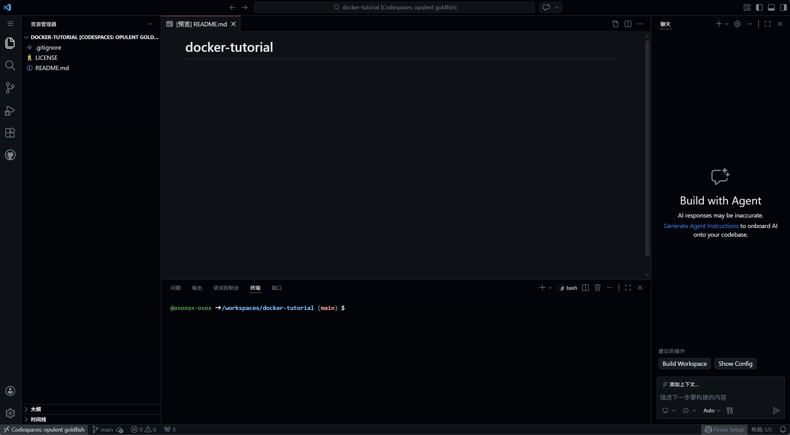

# Docker简单入门

---

[English Version](README-en.md)

---

## 开发中的环境问题

作为开发者，请你试想一下以下画面：

有一天你在家里突发奇想，想用`自己的电脑`写一个`多语言环境混杂`的小游戏给你的朋友们展示一下，好好展示一波来自程序员的`优越感`

结果当你用U盘把这个小游戏带到朋友家里的时候，却发现他们的电脑居然是`Windows11`，而你自己的电脑是`macOS`。

很不幸，你同时也`没有给你的文件夹里写一个requirements.txt文件`。导致这个游戏需要什么依赖一时半会也弄不清楚

一下子装逼就这样变成了打脸（恼）

### 那有没有什么办法来`解决这些问题`呢？

---

对此，我只能说：

### 有的兄弟，有的

这个时候，就需要我们大名鼎鼎的``Docker``出马了（狗头）

---



## 在本次周常中，你将学习到

---

- **Docker是什么**

- **Docker的核心功能**

- **Docker的历史背景**

- **Docker的优势**

- **Docker的架构**

- **Docker的工作流程**

- **Docker基本操作**

- **Docker网络相关操作**

---

## 准备

本次周常中，如果你自己能够在本机上安装Docker，那是`再好不过了`（大悦）

### 如果没有怎么办，难道就要被迫放弃学习了吗？（悲）

不急不急，其实我们早有准备

### 在本次周常你可以在我们的仓库中通过Github上的codespaces来进行学习

如果你乐意的话，可以先根据下面的教程安装Docker Desktop

---

### 安装Docker Desktop

Docker 可以在 Windows、macOS 和 Linux 上运行。

你可以从 Docker 官方网站下载适用于你操作系统的 Docker 安装程序。

### Linux（以ubuntu22.04为例）

```bash
# 下载并执行官方安装脚本
curl -fsSL https://get.docker.com | sudo bash

# 把当前用户加入 docker 组（免 sudo）
sudo usermod -aG docker $USER

# 注销并重新登录生效
newgrp docker
```

### Windows

<https://www.docker.com/products/docker-desktop/> → Download for Windows

运行安装程序，勾选 Use WSL 2 instead of Hyper-V

完成后重启电脑即可

### macOS

官网下载：<https://www.docker.com/products/docker-desktop/>

---

安装完成后，你可以在命令行中运行 docker 命令来验证安装是否成功。

```bash
docker --version
```

如果出现版本信息，则说明安装成功（鼓掌）

下载完成后，请记得重启电脑，随后请直接到如下仓库中：

<https://github.com/CompPsyUnion/docker-tutorial>

clone这个仓库到本地

```bash
git clone https://github.com/CompPsyUnion/docker-tutorial.git
```

之后就可以准备开始学习Docker了

---

如果你不想要在本地安装Docker，你也可以在codespaces中进行学习，

请直接到如下仓库中：

<https://github.com/CompPsyUnion/docker-tutorial>

点击Use this template → Open in a codespaces



---

进入如下界面：



随后就可以在codespaces中进行学习了

---

下载完之后，你可能会想问什么是Docker，为什么它可以成为环境相关问题的重要救星呢？

那接下来，我就来简单介绍一下Docker的相关背景，它到底是什么。

---

## Docker相关背景知识

简单的来说，Docker是一个比较轻量的容器化技术和平台，用于解决编程时常有的环境问题

它通过使用一个container，把应用，依赖和用户态环境包装到一起。

随后如果需要在另一台电脑上运行这个应用，只需要运行这个container即可，而不需要关心这个应用的环境问题。

而今天，我们要学习的便是如何运用Docker来构建一个container，以及如何利用这个container来运行我们的应用。

---

说完了基本概念，我们再来讲讲Docker的历史背景。

---

## Docker的起源

dotCloud 是一个基于云的应用程序平台，它允许开发人员在云端部署和管理应用程序。

Hykes 注意到，在 dotCloud 上运行应用程序时，不同应用需要不同的依赖和运行环境，而这些环境在同一系统中往往难以共存。

这导致了环境配置的问题，因为不同的应用程序可能需要不同的环境。

为了解决这个问题，Hykes 开始思考如何将应用程序和其环境打包在一起，以便在任何地方都可以运行。

进而，Hykes 决定创建一个新的工具，用于打包应用程序和其环境。

而码头工人的名称正好就叫Docker，Hykes认为这个名字和工具的功能很贴切，于是就把这个工具命名为Docker。

Docker就这样产生了

---

那这个时候有人就说了：

> 那虚拟机为什么不能解决这个问题呢？它不也是一个著名的容器化技术吗？

那接下来，我就来简单介绍一下Docker和虚拟机的区别。以及Docker的优势。

---

## Docker的优势

Docker能够在一众容器化技术中脱颖而出，主要有以下几个优势：

- 轻量级与快速
- 可移植性
- 隔离性
- 可扩展性

和虚拟机相比：

| 特性 | Docker | 虚拟机 |
| :--- | :--- | :--- |
| 资源占用 | 轻量级 | 重量级 |
| 启动速度 | 快速 | 缓慢 |
| 可移植性 | 高 | 低 |
| 隔离性 | 进程级隔离 | 完全隔离 |
| 可扩展性 | 高 | 有限 |

这些优势使得Docker在开发者中得到了广泛的应用和认可。在环境处理方面一骑绝尘。


---

Docker的这些优势也一定程度上得益于它的架构设计。

## Docker的架构

Docker可以分为以下几个部分，它们共同构成了Docker的完整生态系统：

- **Docker Client**：用户与Docker交互的命令行工具，负责接收用户命令并发送给Docker Daemon执行
- **Docker Daemon**：后台运行的服务进程，负责处理Docker Client的指令，管理镜像、容器等资源
- **Docker Registry**：镜像仓库，负责存储和分发Docker镜像，类似于GitHub，最常用的是官方的Docker Hub
- **Docker Objects**：包括镜像(Images)、容器(Containers)、网络(Networks)、数据卷(Volumes)等核心对象

Docker采用客户端-服务器架构，Client通过REST API与Daemon通信，可以在本地或远程操作Docker。

---

讲完了架构，我们终于可以开始讲`最最最最最关键的`Docker的工作流程了。

---

## Docker的工作流程

Docker的工作流主要如下所示：

1. **构建镜像**：开发者通过编写Dockerfile来定义应用程序的环境和依赖，然后使用`docker build`命令构建镜像。
2. **分发镜像**：构建好的镜像可以上传到Docker Registry，供其他用户使用。
3. **运行容器**：用户可以从Registry拉取镜像，然后使用`docker run`命令运行容器。
4. **管理容器**：用户可以使用`docker ps`、`docker stop`、`docker restart`等命令来管理运行中的容器。

本次周常中，考虑到大多数人的情况（即使用codespaces），在Docker分发镜像这一个方面，我们只会考虑Docker的pull这一个操作，有兴趣的小伙伴可以查看Docker官方文档，进一步学习如何完全利用Docker Registry这一强大的工具

---

讲到这里，那有人就要问了：

> 那你还没讲容器和镜像这两个到底是个什么东西呢。

莫着急，我这就来先说明一下这两个概念，方便你们之后来理解

**~~可恶，没法偷懒了（悲）~~**

### 什么是容器

容器简单来说就是一系列进程，但是和一般的进程不一样的是，这些进程被施加了一些限制：

- 无法看到除镜像以外的文件（除非你用了数据卷，这个我们之后会再提到）
- 依托镜像的系统文件来运行，用Linux内核来执行进程（不管当前的设备的系统是什么类型）

也正是由于这些限制，容器才可以在任意的设备中运行，不用去关心环境的问题。

---

### 什么是镜像

镜像（只读）由多层（分别在多个文件中记录）组成，每层分别记录不同的容器信息

> 你问为啥只读？当然是为了保证镜像不会被修改啦，否则就会导致镜像被污染，从而影响到其他依赖这个镜像的容器的运行。

---

例如：

- 第一层记录用户态文件系统（例如ubuntu：22.04）
- 第二层记录语言环境（例如python 3.10）
- 第三层 ....

通过压缩和解压缩可以将镜像移植到一台新设备上

在新设备上利用镜像就可以紧接着创建一个容器来运行项目的内容

#### 这些概念一时没理解也没关系，并不太影响Docker的使用

~~不过我觉得你们应该都明白了（迫真）~~

---

接下来是一些具体的操作

我们将通过一个具体的示例来学习Docker的基本操作。

---

### 示例应用：Flask应用

接下来，请移步仓库完成相关的实操环节：

### <https://github.com/CompPsyUnion/docker-tutorial>

~~其实就是之前我让你们准备的时候打开的那个。~~

如果是用codespaces进行练习的话就不需要进行操作了，因为如果你按照我之前的教程去做的话`（不会没有吧）`，你现在已经在正确的位置了

完成练习之后，你现在已经具备了基本的Docker操作能力，你可以根据自己的需求进行一些打包的操作了。

在之后的代码生涯中，请尽情享受无惧环境问题的旅途吧。

---

以下是一些额外的资源，你可以在之后的学习中进行参考：

## Docker相关技术网站

- [Docker官方网站](https://www.docker.com/)
- [Docker Hub](https://hub.docker.com/)
- [Docker文档](https://docs.docker.com/)
- [Docker Compose文档](https://docs.docker.com/compose/)

---
