<!-- Title -->

# GitHub Actions — Automate your workflow

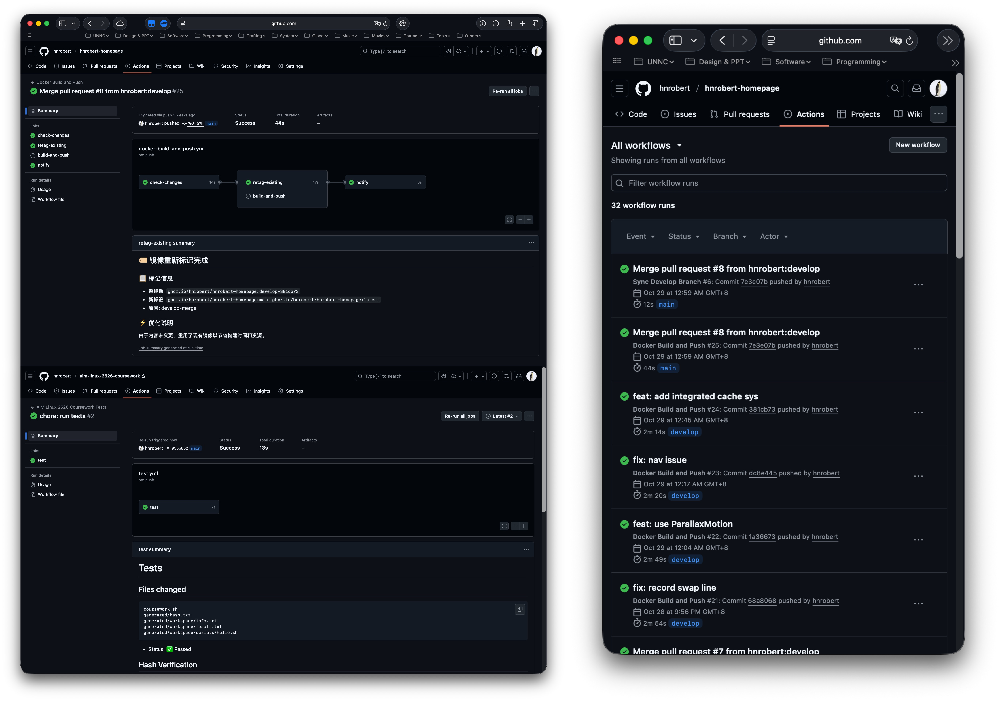

---

## Agenda

- Welcome & Context
- What is GitHub Actions?
- Core Concepts
- Demo: Read a simple workflow
- Hands-On Practice
- Best Practices & Links

---

## Welcome & Context

- Create automations for test, lint, package

---

## What is GitHub Actions?

- CI/CD platform integrated with GitHub repos
- Automate your integration & development workflow on GitHub

---

## Core Concepts

- CI: Continuous Integration automates testing & validation of code changes
- CD: Continuous Deployment automates releasing code to production

---

## Workflows

```text
.github/workflows/*.yml
```

- Automated processes defined by YAML

---

## Events

- Trigger workflows: `push`, `pull_request`, `release`, `schedule`, `workflow_dispatch`

---

## Jobs

- Independent units of work that run in a runner

```yaml
jobs:
  test:
    runs-on: ubuntu-latest
    # steps, ...
```

---

## Steps

```yaml
steps:
  - name: Checkout
    uses: actions/checkout@v4
  - name: Run tests
    run: pytest
```

- Steps are `uses` or `run` commands

---

## Runners

```yaml
runs-on: ubuntu-latest
```

- Virtual environments for jobs

---

## Matrix strategy

```yaml
strategy:
  matrix:
    os: [ubuntu-latest, macos-latest, windows-latest]
    python: [3.8, 3.11]
```

- Run jobs across OS/Python combos (2x3=6 jobs here)

---

## Actions marketplace

- Pre-built actions for common tasks (setup-python, cache, upload-artifact)

---

## Demo: Reading a Simple Workflow (start)

- We'll open the tutorial repo and follow a short hands-on sequence.
- See links in Moodle or in the README to get started.
  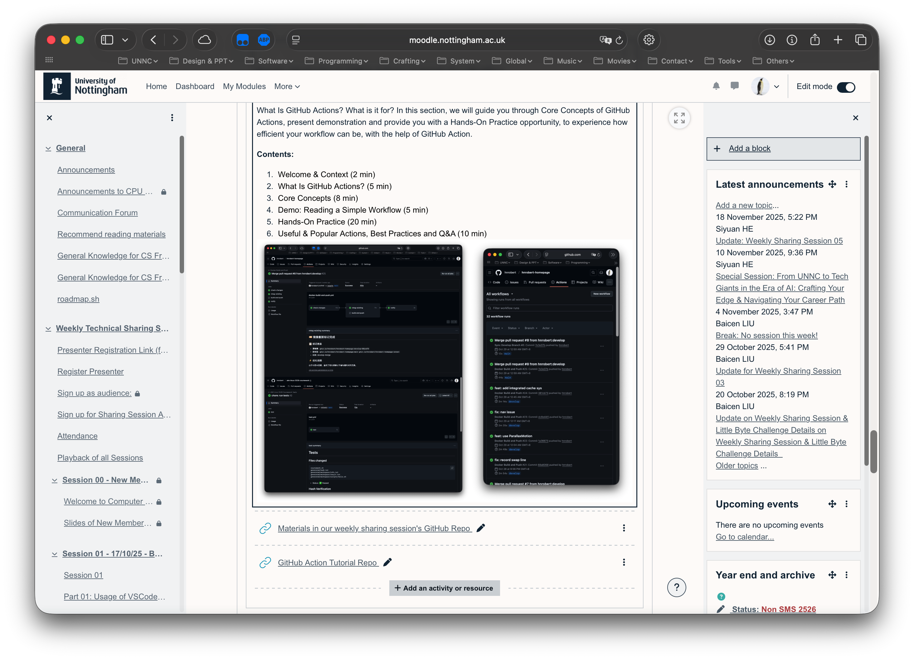

---

<!-- Tutorial - Quick Start -->

## Quick Start — Create a new repo

- Use "Use this template" → Create a new repository

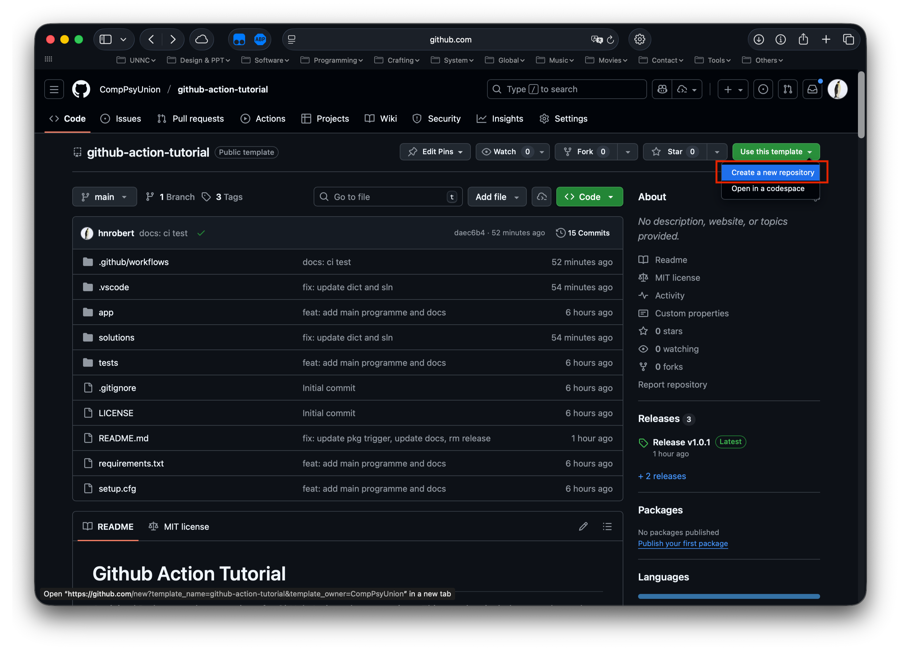

---

## Quick Start — Name your repo

- Give a name & make it public (recommended)

<p align="center">
    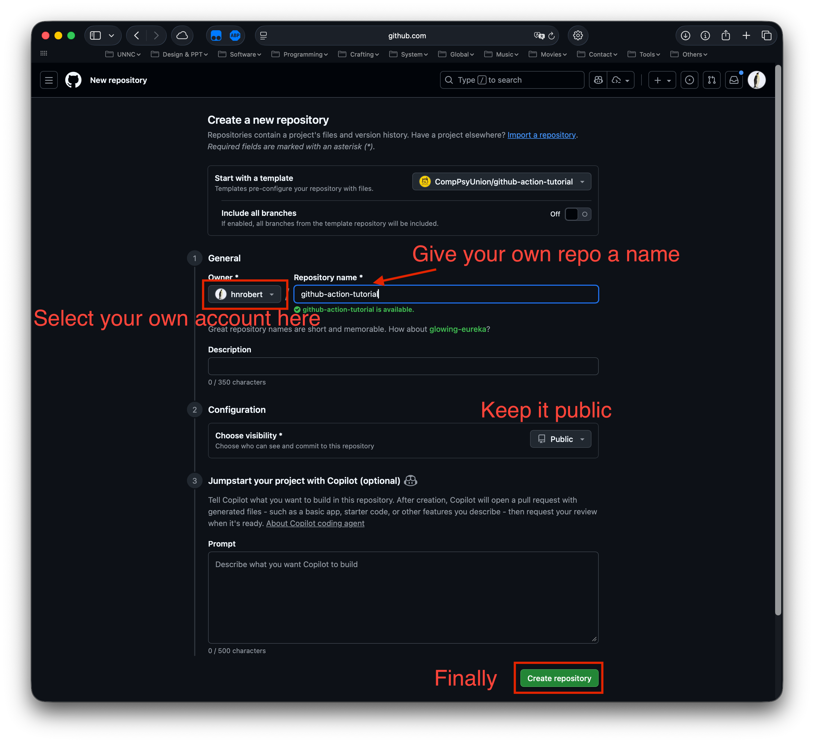
</p>

---

## Open Codespaces (optional)

- Create a codespace on `main` to explore workflows online

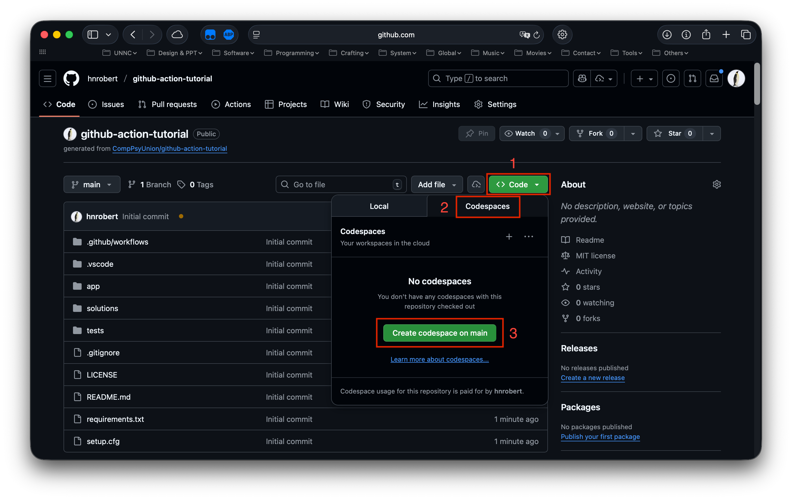

---

## Repo — code, tests & assets

```text
.
├── LICENSE
├── README.md
├── .gitignore
├── app
│   ├── __init__.py
│   └── hello.py
├── assets
│   └── images
│       ├── open-in-workspace.png
│       └── workspace-structure.png
├── requirements.txt
├── solutions
│   ├── package-exercise-original.yml
│   └── package.yml
└── tests
    └── test_hello.py
```

---

## Repo — workflows

- Minimal Python template with `.github/workflows`

  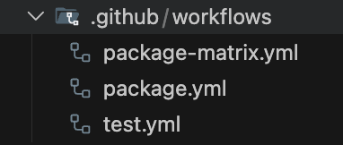

```text
.github/workflows/
  - package-matrix.yml
  - package.yml
  - test.yml
```

- CI definitions live under `.github/workflows`
- Each YAML file defines a workflow

---

## YAML basics

<p align="center">
    
</p>

- Key: values, indentation, lists, nested structures

---

## YAML — key/value

```yaml
name: CI — Test & Lint
```

- Workflow name displayed in the Actions UI

---

> PS: In YAML, strings do not need to be enclosed in quotes unless they contain special characters.  
> All of the following four lines are valid in YAML:
>
> ```yaml
> greeting: Hello
> greeting: Hello World
> greeting: "Hello World"
> path: "/home/user/my folder"
> ```
>
> But THIS is NOT valid:
>
> ```yaml
> path: /home/user/my folder # ❌
> ```

---

## YAML — nested keys

```yaml
on:
  push:
  pull_request:
    branches:
      - main
```

- `on:` defines events that trigger workflows
- `push:` and `pull_request:` are nested under `on:`
  meaning they are parallel triggers

> PS: the value of a key can be empty, as shown above.
> As long as the key is present, the event should trigger the workflow.

---

## YAML — lists & steps

```yaml
branches:
  - main
  - develop
```

**Or the following expression, they are equivalent**

```yaml
branches: [main, develop]
```

---

```yaml
steps:
  - name: Checkout Repo
    uses: actions/checkout@v4
  - name: Run tests
    run: pytest -q
```

If we convert the above to JSON, it would look like this:

```json
"steps": [
  {
    "name": "Checkout Repo",
    "uses": "actions/checkout@v4"
  },
  {
    "name": "Run tests",
    "run": "pytest -q"
  }
]
```

---

## Breakdown of test.yml

- Understanding a simple CI workflow

  

- We'll read through `test.yml` step-by-step first.

---

## Workflow — Name

```yaml
name: CI — Test & Lint
```

- The workflow's display name in Actions UI

<p align="center">
    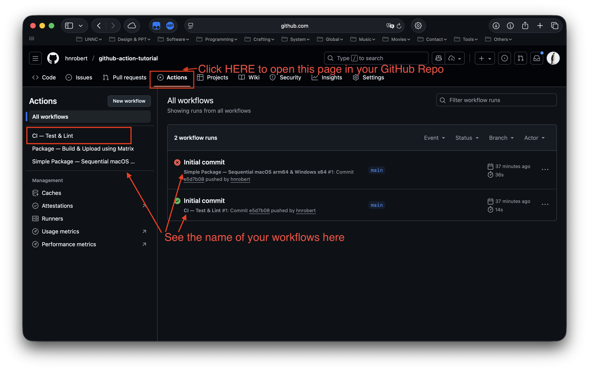
</p>

---

## Workflow — Triggers

```yaml
on:
  push:
    branches: [main]
  pull_request:
    branches: [main]
```

- Triggers the workflow on pushes and PRs to `main`

---

## Jobs — top-level

```yaml
jobs:
  test:
    runs-on: ubuntu-latest
```

- Each job runs on a runner; jobs can run in parallel

---

## Job — Runs-on

```yaml
runs-on: ubuntu-latest
```

- Choose `ubuntu`, `macos`, `windows`, or self-hosted runners

---

## Job — Steps (overview)

```yaml
jobs:
  test:
    # ...
    steps:
      - name: Checkout Repo
        # ...
      - name: Set up Python
        # ...
      - name: Install dependencies
        # ...
      - name: Run lint
        # ...
      - name: Run tests
        # ...
```

- Steps are executed sequentially inside a job

---

## Step: Checkout the repo

```yaml
- name: Checkout Repo
  uses: actions/checkout@v4
```

- Grants the job access to repository code

---

## Step: Set up Python

```yaml
- name: Set up Python
  uses: actions/setup-python@v4
  with:
    python-version: '3.11'
```

- Installs Python without manual commands

---

## Step: Install dependencies

```yaml
- name: Install dependencies
  run: |
    python -m pip install --upgrade pip
    pip install -r requirements.txt
```

- Ensures library dependencies are available

---

## Step: Run linting

```yaml
- name: Run autopep8 check
  run: |
    pip install autopep8
    autopep8 --diff --recursive app tests
```

- Keeps code style consistent

---

## Step: Run tests

```yaml
- name: Run tests
  env:
    PYTHONPATH: ${{ github.workspace }}
  run: pytest -q
```

- Executes test suite and reports failures

---

### How to package this project locally (for reference)

Usually we would build a standalone executable for such small project with PyInstaller.

On macOS/Linux:

```bash
python3 -m venv .venv
source .venv/bin/activate
.venv/bin/pip install -r requirements.txt
.venv/bin/pyinstaller --onefile app/hello.py
ls -la dist
```

On Windows PowerShell:

```powershell
python -m venv .venv
.\.venv\Scripts\Activate.ps1
.venv\Scripts\pip.exe install -r requirements.txt
.venv\Scripts\pyinstaller.exe --onefile app/hello.py
dir dist
```

---

## Exercise

But to upload your build artifacts every time to GitHub from local would be tedious, so we often automate this with GitHub Actions.

- Implement package.yml
- Commit your workflow updates & push (sync) to trigger the workflow run

<p align="center">
    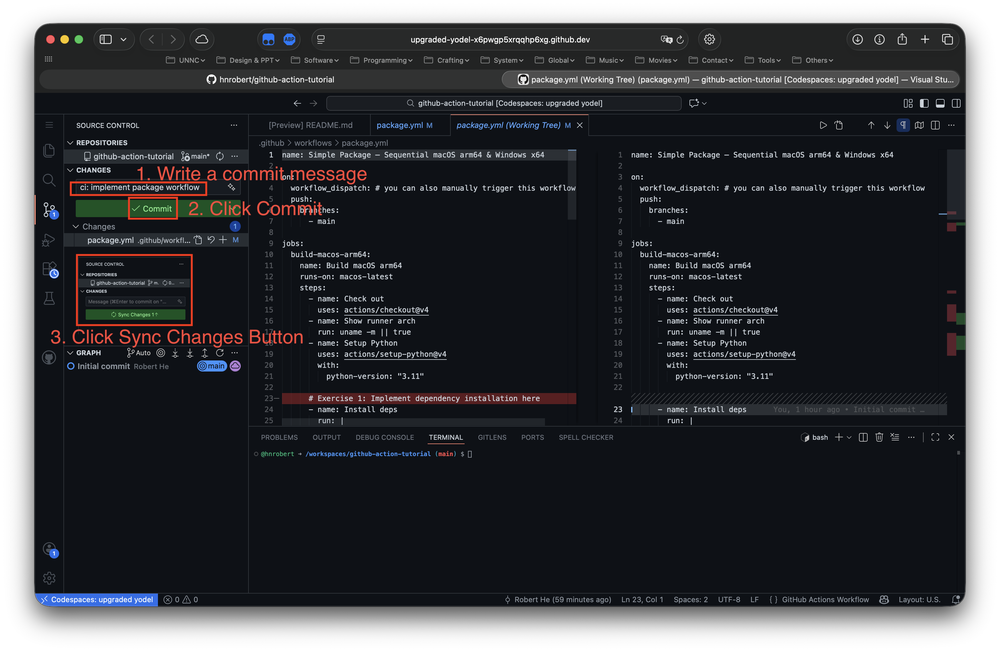
</p>

---

## Watch workflow running

- Jobs show logs and status in Actions tab

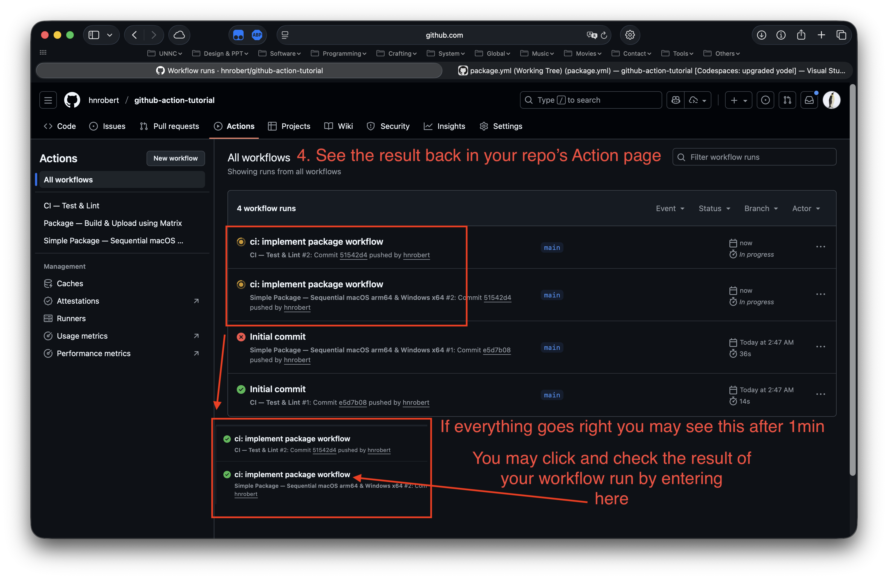

---

## Watch workflow running - details

<p align="center">
    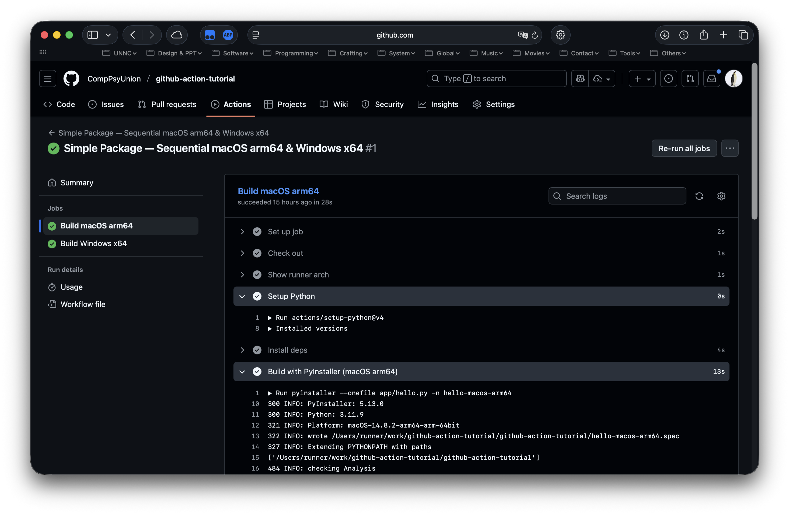
</p>

---

## Packaging exercise — result

- Artifacts built & uploaded automatically

<p align="center">
    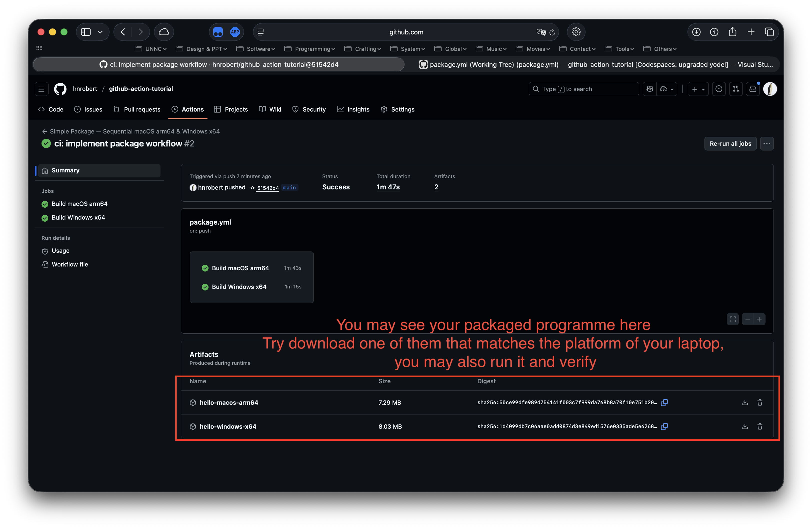
</p>

---

## More job features

```yaml
strategy:
  matrix:
    os: [ubuntu-latest, macos-latest, windows-latest]
needs: [build]
```

- `strategy` and `needs` help with matrices and dependencies

---

## Release flow (automatic packaging and upload assets to release)

The repository includes a workflow that automatically builds packages for multiple OS/Python combinations and attaches the build artifacts to a GitHub Release.

- `package-matrix.yml` — runs packaging on `ubuntu`, `macos`, and `windows` using a matrix and attaches the build artifacts to the release when the workflow is triggered by the `release` event.

---

## Release permission — Settings

- Wait, your workflow need some permissions to upload assets to release
- Grant "Read and write" to allow uploading release assets

<p align="center">
    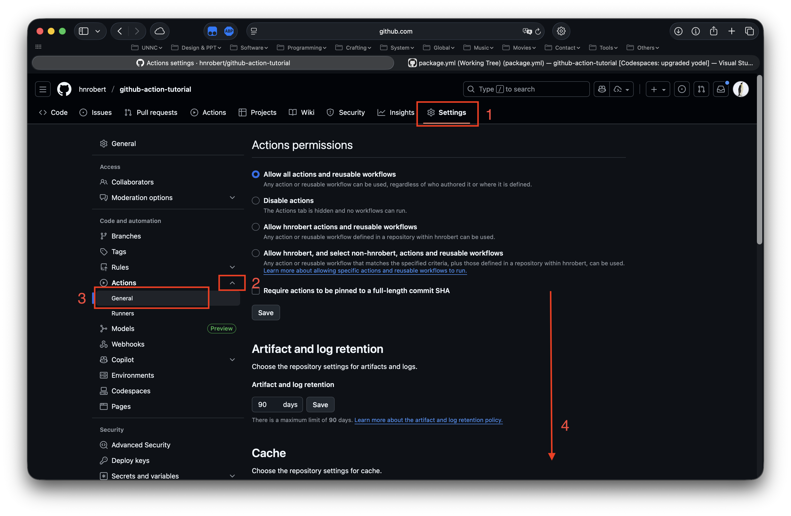
</p>

---

## Release permission — Set workflow permissions

- Choose "Read and write permissions" and save

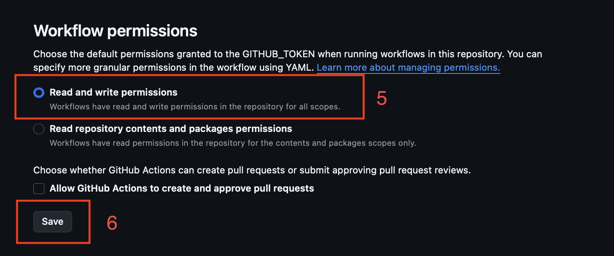

---

## Create Release — Start

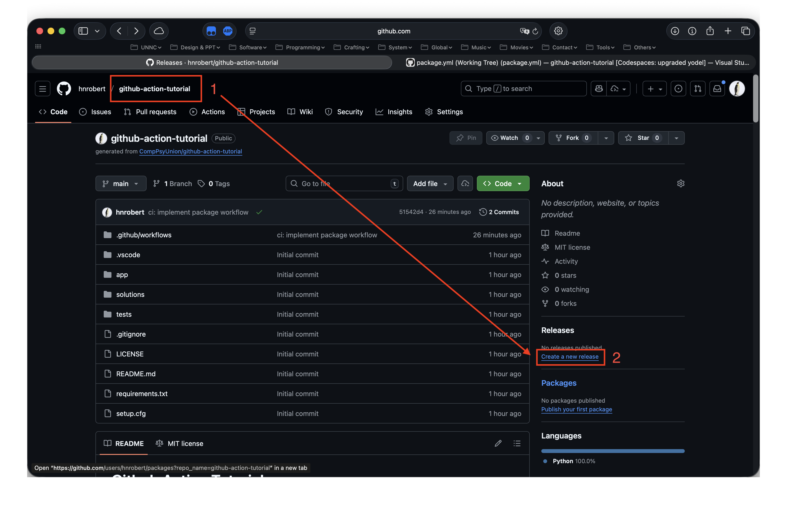

- Click to start a new release

---

## Create Release — Tag & Title

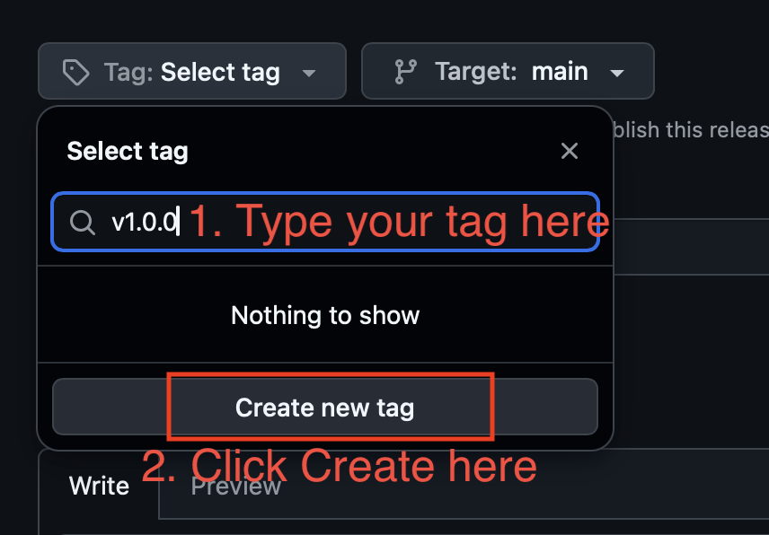

- Add tag (e.g., `v1.0.0`) and title

---

## Publish Release

- Click to publish; workflows can auto-run on release

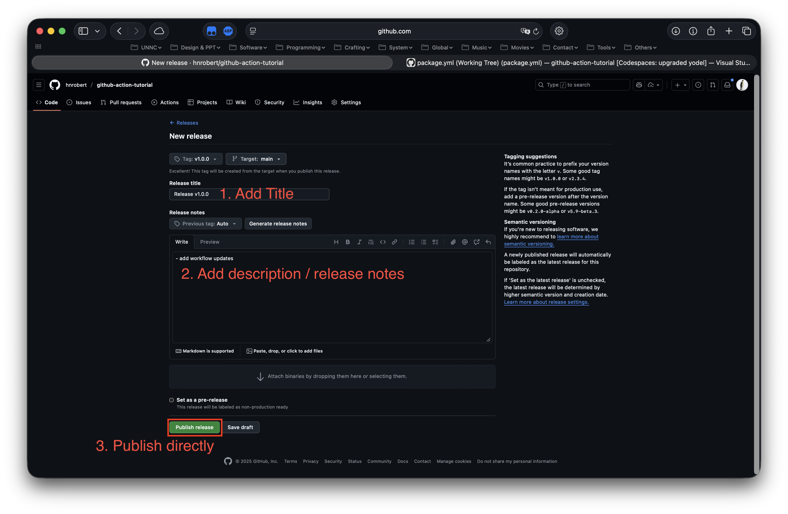

---

## Auto-build

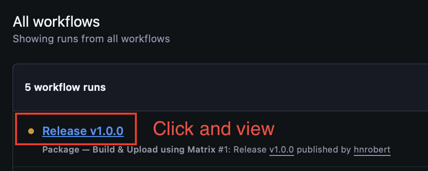

- Click the Release title in Actions tab to see build progress

---

## Matrix success & artifacts

- Check artifacts and success across OSes

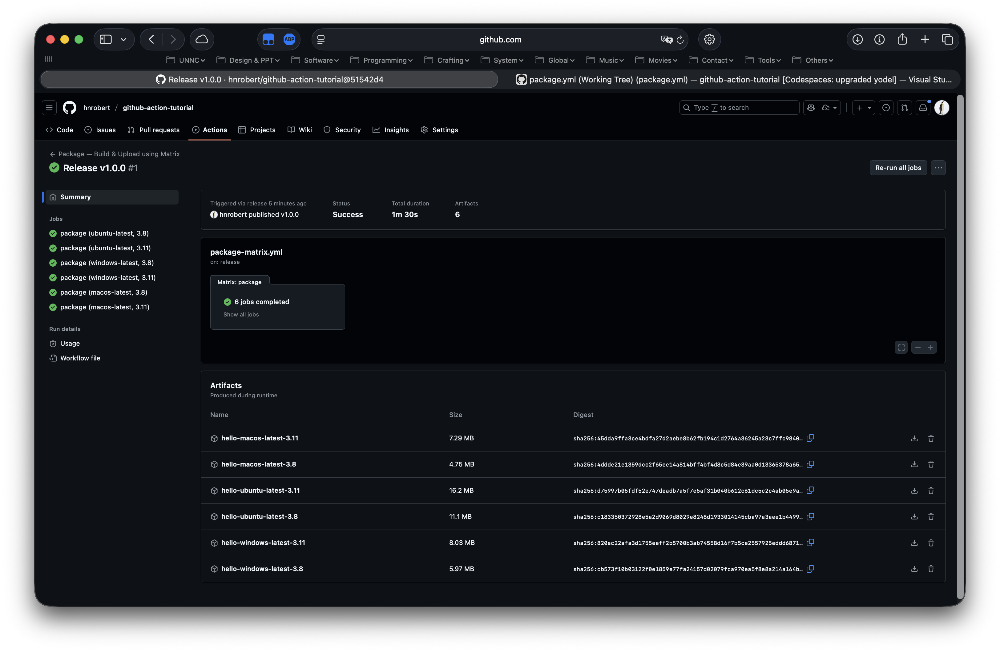

---

## Release Page & Artifacts

- Build artifacts are attached to the release

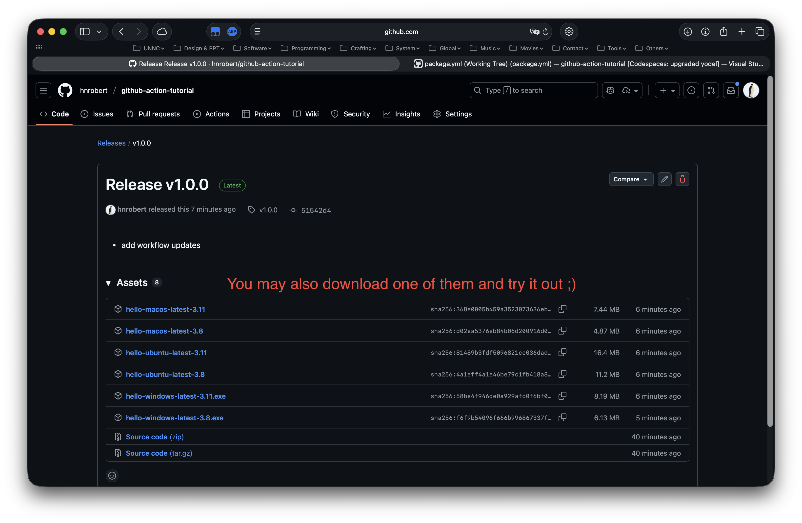

---

## Best Practices

- Keep CI jobs small
- Cache dependencies for speed
- Use marketplace actions for common tasks

---

## Popular Actions

- `actions/checkout` — checkout the repository
- `actions/setup-python` — set up Python
- `actions/setup-node` — set up Node.js
- `actions/setup-go` — set up Go
- `actions/setup-dotnet` — set up .NET
- `actions/upload-artifact` — upload artifacts
- `actions/cache` — cache dependencies
- `pytest` and `autopep8` for testing and automatic formatting

---

## Q&A ;)

Any questions so far?

Ask what you want to do with GitHub Actions!

---

## Useful Links

- GitHub Actions docs: https://docs.github.com/en/actions

---

## The End

Thank you!
