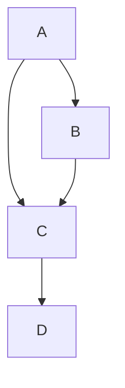

<!-- 已移除 nodeppt 元数据和 <slide> 标签。
	 本文件现在为演示用 Markdown：每页保留“PPT 内容”与对应“讲稿（Speaker Notes）”。
-->

## 幻灯片 1 — PPT 内容

# Markdown 从入门到入土

- 你是否想有一个工具能让排版变得简单？
- 你是否想有一个工具能让笔记干净整洁？
- 你是否想有一个工具能让写作一次，多处可用？
- 你是否想有一个工具能让文字专注内容，不被格式分心？
- 你是否想有一个工具能方便地在所有平台轻量展示？

### 讲稿（30–60 秒）

- 开场：介绍主题与目标——让听众知道今天要学什么、为什么学
- 要点：Markdown 帮你专注内容、跨平台、轻量易学

---

## 幻灯片 2 — PPT 内容

# 常见的 Markdown 用途

- GitHub README
- 文档说明
- 博客撰写
- 幻灯片/演示

### 讲稿（30–45 秒）

- 举例：README 用于项目简介；文档用于团队协作；博客用于发布文章；幻灯片用于教学与展示

---

## 幻灯片 3 — PPT 内容

# 编辑器

1. Typora（所见即所得）
2. Visual Studio Code（插件丰富，适合工程化）


### 讲稿（45 秒）

- 建议：初学用 Typora；需要项目集成或代码编辑用 VSCode
- 快演示：在 VSCode 中打开预览（Cmd/Ctrl+K V）

---

## 幻灯片 4 — PPT 内容

# 基础语法 — 标题

示例：

```markdown
# 一级标题
## 二级标题
### 三级标题
```

### 讲稿（30–40 秒）

- 说明标题用于组织内容层级，保持一致性

---

## 幻灯片 5 — PPT 内容

# 基础语法 — 文本修饰

示例：斜体、加粗、删除线、下划线（HTML）、上/下标、高亮

```markdown
*斜体*  **加粗**  ~~删除线~~  <u>下划线</u>
正常文本和~下标~与^上标^
==高亮==
```

### 讲稿（30 秒）

- 说明强调用途与避免过度使用的原则

---

## 幻灯片 6 — PPT 内容

# 基础语法 — 列表与 Checklist

```markdown
1. 有序项一
2. 有序项二
3. 有序项三

* 无序项
- 另一个无序项

- [ ] 未完成
- [x] 已完成
```

### 讲稿（35 秒）

- 演示有序/无序及 Checklist 的常见场景（任务、议程）

---

## 幻灯片 7 — PPT 内容

# 基础语法 — 引用与代码

> 这是一个引用示例

行内代码：`inline code`

代码块：

```python
print("Hello world")
```

### 讲稿（40 秒）

- 引用用于摘录或强调外部文本；代码块带语言标签可高亮

---

## 幻灯片 8 — PPT 内容

# 基础语法 — 表格

```markdown
| First Header | Second Header |
|--------------|---------------|
| Content A    | Content B     |
```

### 讲稿（30 秒）

- 表格适合展示参数对比、配置项等结构化信息；推荐用 Typora 辅助编辑

---

## 幻灯片 9 — PPT 内容

# 基础语法 — 脚注

```markdown
这是一个带脚注的示例[^1]

[^1]: 这是脚注内容
```

### 讲稿（20 秒）

- 适用于学术或需要补充说明的场景

---

## 幻灯片 10 — PPT 内容

# 链接与图片

[项目主页](https://github.com/Gentle-Lijie)


### 讲稿（30 秒）

- 图片建议放图床或仓库，注意版权与加载速度

---

## 幻灯片 11 — PPT 内容

# 扩展语法

<!-- 已移除 nodeppt 元数据与 <slide> 标签。文件为演示稿：每页包含“PPT 内容”（可直接复制到幻灯片）和对应的“讲稿（Speaker Notes）”。 -->

## 幻灯片 1 — PPT 内容

# Markdown 从入门到入土

- 你是否想有一个工具能让排版变得简单？
- 你是否想有一个工具能让笔记干净整洁？
- 你是否想有一个工具能让写作一次，多处可用？
- 你是否想有一个工具能让文字专注内容，不被格式分心？
- 你是否想有一个工具能方便地在所有平台轻量展示？

### 讲稿（30–60 秒）

- 开场：一句话说明今天主题与目标，快速激发兴趣
- 要点：Markdown 的优势（简洁、跨平台、专注内容）

---

## 幻灯片 2 — PPT 内容

# 常见的 Markdown 用途

- GitHub README
- 文档说明
- 博客撰写
- 幻灯片/演示

### 讲稿（30–45 秒）

- 逐条说明用途与场景，举 1 个实例说明 README 的作用

---

## 幻灯片 3 — PPT 内容

# 编辑器

1. Typora（所见即所得）
2. Visual Studio Code（插件丰富，适合工程化）


### 讲稿（45 秒）

- 建议：初学用 Typora；需要工程化用 VSCode
- 演示：VSCode 打开预览的快捷键（Cmd/Ctrl+K V）

---

## 幻灯片 4 — PPT 内容

# 基础语法 — 标题

示例：

```markdown
# 一级标题
## 二级标题
### 三级标题
```

### 讲稿（30–40 秒）

- 说明标题用于组织结构与层级，保持一致性

---

## 幻灯片 5 — PPT 内容

# 基础语法 — 文本修饰

示例：斜体、加粗、删除线、下划线（HTML）、上/下标、高亮

```markdown
*斜体*  **加粗**  ~~删除线~~  <u>下划线</u>
正常文本和~下标~与^上标^
==高亮==
```

### 讲稿（30 秒）

- 说明何时使用强调与加粗，避免视觉噪音

---

## 幻灯片 6 — PPT 内容

# 基础语法 — 列表与 Checklist

```markdown
1. 有序项一
2. 有序项二
3. 有序项三

* 无序项
- 另一个无序项

- [ ] 未完成
- [x] 已完成
```

### 讲稿（35 秒）

- 演示有序/无序与 Checklist 的典型场景（任务、议程）

---

## 幻灯片 7 — PPT 内容

# 基础语法 — 引用与代码

> 这是一个引用示例

行内代码：`inline code`

代码块示例：

```python
print("Hello world")
```

### 讲稿（40 秒）

- 引用用于摘录；代码块加语言标注可获得高亮，现场可演示

---

## 幻灯片 8 — PPT 内容

# 基础语法 — 表格

```markdown
| First Header | Second Header |
|--------------|---------------|
| Content A    | Content B     |
```

### 讲稿（30 秒）

- 表格适合对比与参数展示，建议用 Typora 辅助编辑

---

## 幻灯片 9 — PPT 内容

# 基础语法 — 脚注

```markdown
这是一个带脚注的示例[^1]

[^1]: 这是脚注内容
```

### 讲稿（20 秒）

- 适用于学术或需要补充说明的场景

---

## 幻灯片 10 — PPT 内容

# 链接与图片

[项目主页](https://github.com/Gentle-Lijie)


### 讲稿（30 秒）

- 图片放图床或仓库管理，注意版权与加载速度

---

## 幻灯片 11 — PPT 内容

# 扩展语法

- 数学公式（KaTeX/LaTeX），例如 $x_{1,2}=\dfrac{-b\pm \sqrt{b^2-4ac}}{2a}$
- TOC 与其他插件视渲染器支持而定
- Mermaid：绘制流程图

示例 Mermaid：



### 讲稿（45 秒）

- 提醒：并非所有平台都支持这些扩展，选择工具时确认支持情况

---

## 幻灯片 12 — PPT 内容

# 结语与行动建议

- 新建一个 `.md` 文件，写下你的第一篇笔记
- 练习建议：写一个 README 或一篇短笔记

### 讲稿（30 秒）

- 邀请听众动手练习并提供后续资源或答疑渠道


- 引用用于摘录或强调他人的话
- 代码块加语言标记可获得高亮，现场可演示

---

## 幻灯片 8 — PPT 内容

# 基础语法 - 表格

示例：

```markdown
| First Header  | Second Header |
| ------------- | ------------- |
| Content Cell  | Content Cell  |
```

### 讲稿（30 秒）：

- 表格适用于结构化信息，如参数或对比表
- 建议使用 Typora 辅助编辑表格

---

## 幻灯片 9 — PPT 内容

# 基础语法 - 脚注

示例：

```markdown
通过这个创建一个[^1]脚注

[^1]: 这是一个脚注
```

### 讲稿（20 秒）：

- 适用于学术或正式文本的引用与补充说明

---

## 幻灯片 10 — PPT 内容

# 基础语法 - 链接和图片

链接示例：

[项目主页](https://github.com/Gentle-Lijie)

图片示例：


### 讲稿（30 秒）：

- 图片建议放图床或仓库中管理，注意版权与大小

---

## 幻灯片 11 — PPT 内容

# 扩展语法

- 数学公式（KaTeX/LaTeX）：例如 $x_{1,2}=\dfrac{-b\pm \sqrt{b^2-4ac}}{2a}$
- TOC、插件等依渲染器支持
- Mermaid：流程图与关系图

示例 Mermaid：


### 讲稿（45 秒）：

- 提醒并非所有平台都支持扩展语法，选择合适的渲染器

---

## 幻灯片 12 — PPT 内容

# 结语与行动建议

新建一个 `.md` 文件，写下你的第一篇笔记。

> 原来写作和排版可以这么简单、这么高效。

### 讲稿（30 秒）：

- 结尾呼吁：邀请听众动手练习（写 README 或短笔记）
- 提供后续资源或答疑渠道


