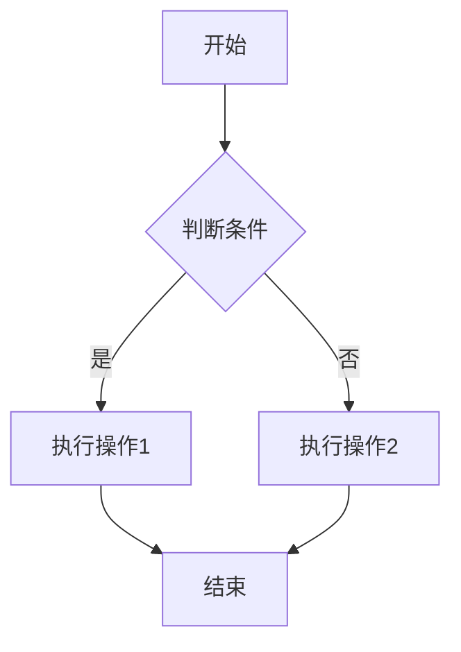

# Markdown 入门教程

## 目录

1. [什么是 Markdown](#什么是-markdown)
2. [为什么要学习 Markdown](#为什么要学习-markdown)
3. [常见用途](#常见用途)
4. [编辑器推荐](#编辑器推荐)
5. [基础语法](#基础语法)
6. [扩展语法](#扩展语法)
7. [实践建议](#实践建议)

---

## 什么是 Markdown

Markdown 是一种轻量级标记语言，它允许你使用易读易写的纯文本格式编写文档，然后转换成结构化的 HTML 文档。Markdown 由 John Gruber 于 2004 年创建，目标是让人们"使用易读易写的纯文本格式编写文档，然后转换成有效的 HTML 文档"。

## 为什么要学习 Markdown

使用 Markdown 有以下几个显著优势：

- **排版简单**：专注内容而非格式，让写作更高效
- **笔记干净整洁**：纯文本格式，没有复杂的格式标记
- **一次编写，多处可用**：可以轻松转换为 HTML、PDF 等多种格式
- **专注内容**：不会被复杂的格式工具分散注意力
- **跨平台轻量展示**：任何文本编辑器都能打开和编辑
- **版本控制友好**：纯文本格式便于使用 Git 等工具进行版本管理

## 常见用途

Markdown 在多个领域都有广泛应用：

### 1. GitHub README
项目说明文档，介绍项目功能、安装方法、使用说明等。

### 2. 文档说明
技术文档、API 文档、用户手册等，便于团队协作和知识共享。

### 3. 博客撰写
许多静态博客生成器（如 Hexo、Jekyll、Hugo）都使用 Markdown 作为内容格式。

### 4. 笔记与知识管理
Notion、Obsidian、Typora 等工具都支持 Markdown，方便整理和管理知识。

### 5. 演示文稿
使用工具如 Marp、Reveal.js 可以将 Markdown 转换为幻灯片。

## 编辑器推荐

### 1. Typora（推荐入门使用）
- **特点**：所见即所得（WYSIWYG），实时预览
- **适合**：初学者、注重写作体验的用户
- **优势**：界面简洁，支持多种主题，导出功能强大

### 2. Visual Studio Code（推荐进阶使用）
- **特点**：插件丰富，适合工程化项目
- **适合**：程序员、需要版本控制的用户
- **快捷键**：`Cmd/Ctrl + K` 然后按 `V` 可以打开侧边预览
- **优势**：支持 Git 集成、代码片段、多种扩展

### 3. 其他选择
- **Obsidian**：适合构建个人知识库
- **Notion**：支持 Markdown 的协作文档工具
- **在线编辑器**：如 StackEdit、Dillinger

---

## 基础语法

### 1. 标题

使用 `#` 符号来创建标题，`#` 的数量表示标题级别：

```markdown
# 一级标题
## 二级标题
### 三级标题
#### 四级标题
##### 五级标题
###### 六级标题
```

**效果展示：**

# 一级标题
## 二级标题
### 三级标题

**注意事项**：
- 保持标题层级的一致性，不要跳级
- 一级标题通常只使用一次（作为文档标题）
- `#` 后面要加一个空格

---

### 2. 文本修饰

Markdown 支持多种文本样式：

```markdown
*斜体文本* 或 _斜体文本_

**加粗文本** 或 __加粗文本__

***粗斜体文本*** 或 ___粗斜体文本___

~~删除线文本~~

<u>下划线文本</u>（HTML 语法）

正常文本~下标~ 和 ^上标^

==高亮文本==（部分编辑器支持）
```

**效果展示：**

*斜体文本*  
**加粗文本**  
***粗斜体文本***  
~~删除线文本~~  
<u>下划线文本</u>

**使用建议**：
- 使用加粗来强调重要内容
- 使用斜体来表示术语或引用
- 避免过度使用样式，保持文档简洁

---

### 3. 列表

#### 有序列表

```markdown
1. 第一项
2. 第二项
3. 第三项
   1. 子项 1
   2. 子项 2
```

**效果：**

1. 第一项
2. 第二项
3. 第三项
   1. 子项 1
   2. 子项 2

#### 无序列表

```markdown
* 项目一
* 项目二
* 项目三

或者使用 `-` 或 `+`：

- 项目一
- 项目二
- 项目三
```

**效果：**

- 项目一
- 项目二
- 项目三

#### 任务列表（Checklist）

```markdown
- [ ] 未完成的任务
- [x] 已完成的任务
- [ ] 待办事项
```

**效果：**

- [ ] 未完成的任务
- [x] 已完成的任务
- [ ] 待办事项

**应用场景**：
- 项目任务跟踪
- 会议议程
- 购物清单
- 学习计划

---

### 4. 引用与代码

#### 引用块

```markdown
> 这是一个引用文本示例
> 
> 可以包含多个段落
> 
> > 引用也可以嵌套
```

**效果：**

> 这是一个引用文本示例
> 
> 可以包含多个段落
> 
> > 引用也可以嵌套

#### 行内代码

使用反引号 `` ` `` 包裹行内代码：

```markdown
这是一段包含 `inline code` 的文本。
```

**效果：**

这是一段包含 `inline code` 的文本。

#### 代码块

使用三个反引号 ```` ``` ```` 创建代码块，可以指定语言以获得语法高亮：

````markdown
```python
def hello_world():
    print("Hello, World!")
    
hello_world()
```

```javascript
function helloWorld() {
    console.log("Hello, World!");
}

helloWorld();
```
````

**效果：**

```python
def hello_world():
    print("Hello, World!")
    
hello_world()
```

**支持的常见语言标识**：
- `python`, `java`, `javascript`, `c`, `cpp`, `go`, `rust`
- `html`, `css`, `json`, `xml`, `yaml`
- `bash`, `shell`, `sql`, `markdown`

---

### 5. 表格

```markdown
| 表头1 | 表头2 | 表头3 |
|-------|-------|-------|
| 内容A | 内容B | 内容C |
| 内容D | 内容E | 内容F |
```

**效果：**

| 表头1 | 表头2 | 表头3 |
|-------|-------|-------|
| 内容A | 内容B | 内容C |
| 内容D | 内容E | 内容F |

**对齐方式**：

```markdown
| 左对齐 | 居中对齐 | 右对齐 |
|:-------|:--------:|-------:|
| 左     | 中       | 右     |
| Left   | Center   | Right  |
```

| 左对齐 | 居中对齐 | 右对齐 |
|:-------|:--------:|-------:|
| 左     | 中       | 右     |
| Left   | Center   | Right  |

**使用建议**：
- 使用 Typora 等编辑器可以更方便地编辑表格
- 表格适合展示结构化数据、参数对比等
- 不要在表格中放置过多内容

---

### 6. 链接与图片

#### 链接

```markdown
[链接文本](https://example.com)

[带标题的链接](https://example.com "鼠标悬停显示的标题")

<https://example.com> （自动链接）
```

**效果：**

[链接文本](https://github.com/Gentle-Lijie)

#### 图片

```markdown


```

**效果：**


**图片管理建议**：
- 使用图床服务（如 SM.MS、ImgURL）
- 将图片放在项目的 `assets` 或 `images` 文件夹中
- 注意图片版权和文件大小
- 使用有意义的图片描述（Alt 文本）以提高可访问性

---

### 7. 脚注

```markdown
这是一段包含脚注的文本[^1]，还有另一个脚注[^note]。

[^1]: 这是第一个脚注的内容。
[^note]: 这是一个命名脚注。
```

**效果：**

这是一段包含脚注的文本[^1]。

[^1]: 这是脚注的内容。

**适用场景**：
- 学术论文
- 技术文档的参考引用
- 需要补充说明但不想打断正文的情况

---

## 扩展语法

### 1. 数学公式

使用 LaTeX 语法编写数学公式（需要编辑器或渲染器支持）：

**行内公式**：

```markdown
这是一个行内公式 $E=mc^2$
```

**效果：** $E=mc^2$

**块级公式**：

```markdown
$$
x_{1,2} = \frac{-b \pm \sqrt{b^2-4ac}}{2a}
$$
```

**效果：**

$$
x_{1,2} = \frac{-b \pm \sqrt{b^2-4ac}}{2a}
$$

### 2. 流程图（Mermaid）

部分编辑器支持 Mermaid 语法绘制流程图：

````markdown

````

**效果：**


### 3. 目录（TOC）

许多 Markdown 编辑器和渲染器支持自动生成目录：

```markdown
[TOC]

或

[[toc]]
```

**注意**：不同编辑器的 TOC 语法可能不同。

### 4. 注意事项

**兼容性提醒**：

- 并非所有平台都支持这些扩展语法
- 使用前请确认目标平台的支持情况
- 常见支持平台：GitHub、GitLab、Typora、Obsidian、VS Code（需插件）

---

## 实践建议

### 1. 立即开始

**动手练习**：


大家可以尝试一下实现下面这样的内容


---

<br/>

**题目：实现一个函数，判断一个字符串是否为回文串。**

> 回文串是指正着读和反着读都一样的字符串，例如 `level`、`noon`。

**题解思路**：

1. **去除空格和大小写影响**  
    使用 `str.lower()` 和 `str.replace()` 处理输入。

2. **双指针法**  
    用两个指针分别从字符串两端向中间移动，比较字符是否相同。

**代码实现**：

```python
def is_palindrome(s):
     s = s.lower().replace(' ', '')
     return s == s[::-1]

# 测试用例
print(is_palindrome("Level"))      # True
print(is_palindrome("Hello"))      # False
print(is_palindrome("A man a plan a canal Panama"))  # True
```

- [x] 处理大小写
- [x] 去除空格
- [x] 使用切片反转字符串
- [ ] 处理标点符号（可扩展）

**总结**：  
*回文判断* 是字符串处理的常见题型，掌握文本预处理和切片技巧非常重要。  
~~不要忘记考虑特殊情况，比如空字符串或只有一个字符。~~  
__多练习几种实现方式，可以提升代码能力！__

---

### 2. 相关资源

- [Markdown 官方教程](https://www.markdownguide.org/)
- [GitHub Flavored Markdown](https://github.github.com/gfm/)
- [CommonMark 规范](https://commonmark.org/)

### 3. 最佳实践

- **保持简洁**：不要过度使用格式
- **语义化**：使用正确的标记（如标题层级）
- **一致性**：在同一文档中保持风格一致
- **可读性**：即使是纯文本也应该易读
- **版本控制**：善用 Git 管理你的 Markdown 文档

---

## 结语


Markdown 让你能够专注于内容创作，而不是被复杂的格式工具所困扰。无论你是程序员、作家、学生还是知识工作者，Markdown 都能成为你高效工作的得力助手。

现在就开始你的 Markdown 之旅吧！新建一个 `.md` 文件，写下你的第一篇笔记。

---

**参考资料与延伸阅读**：
- [Markdown 官方文档](https://daringfireball.net/projects/markdown/)
- [GitHub Markdown 指南](https://guides.github.com/features/mastering-markdown/)
- [Markdown 编辑器对比](https://www.markdownguide.org/tools/)

**作者**：周立杰  
**项目主页**：[GitHub](https://github.com/Gentle-Lijie)  
**最后更新**：2025年10月
