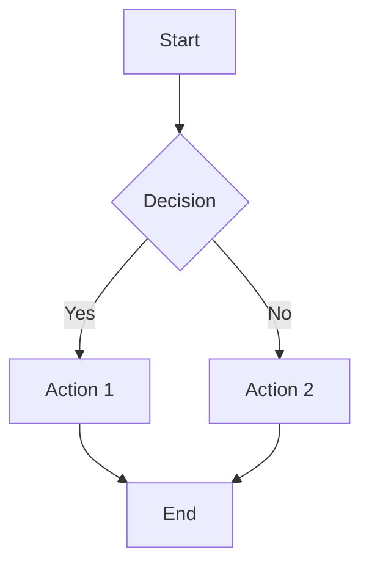

# Markdown Beginner's Guide

## Table of Contents

1. [What is Markdown](#what-is-markdown)
2. [Why learn Markdown](#why-learn-markdown)
3. [Common uses](#common-uses)
4. [Editor recommendations](#editor-recommendations)
5. [Basic syntax](#basic-syntax)
6. [Extended syntax](#extended-syntax)
7. [Practical tips](#practical-tips)

---

## What is Markdown

Markdown is a lightweight markup language that lets you write documents in an easy-to-read and easy-to-write plain text format, which can then be converted into structured HTML. Markdown was created by John Gruber in 2004 with the goal of allowing people to "write documents in an easy-to-read and easy-to-write plain text format, then convert them into valid HTML documents." 

## Why learn Markdown

Using Markdown offers several notable advantages:

- **Simple formatting**: Focus on content rather than formatting, making writing more efficient
- **Clean notes**: Plain text format without complex formatting markers
- **Write once, use anywhere**: Easily convert to HTML, PDF, and other formats
- **Content-focused**: Avoid distraction from complex formatting tools
- **Cross-platform lightweight display**: Any text editor can open and edit Markdown files
- **Version control friendly**: Plain text works well with Git and other version control tools

## Common uses

Markdown is widely used in many areas:

### 1. GitHub README
Project documentation that introduces project features, installation instructions, usage, etc.

### 2. Documentation
Technical docs, API documentation, and user manuals—useful for team collaboration and knowledge sharing.

### 3. Blogging
Many static site generators (e.g., Hexo, Jekyll, Hugo) use Markdown as the content format.

### 4. Note-taking and knowledge management
Tools like Notion, Obsidian, and Typora support Markdown, making it convenient to organize and manage knowledge.

### 5. Presentations
Tools like Marp and Reveal.js can convert Markdown into slides.

## Editor recommendations

### 1. Typora (recommended for beginners)
- **Features**: WYSIWYG, live preview
- **Good for**: Beginners and users who prefer a smooth writing experience
- **Advantages**: Clean interface, multiple themes, powerful export options

### 2. Visual Studio Code (recommended for advanced users)
- **Features**: Rich plugin ecosystem, suitable for engineering projects
- **Good for**: Developers and users who need version control
- **Shortcuts**: `Cmd/Ctrl + K` then `V` opens the side preview
- **Advantages**: Git integration, snippets, and many extensions

### 3. Other options
- **Obsidian**: Great for building a personal knowledge base
- **Notion**: A collaborative tool that supports Markdown
- **Online editors**: e.g., StackEdit, Dillinger

---

## Basic syntax

### 1. Headings

Use `#` to create headings; the number of `#` characters indicates the heading level:

```markdown
# H1
## H2
### H3
#### H4
##### H5
###### H6
```

**Notes**:
- Keep heading levels consistent and avoid skipping levels
- Typically use only one H1 as the document title
- Add a space after the `#`

---

### 2. Text formatting

Markdown supports several text styles:

```markdown
*italic* or _italic_

**bold** or __bold__

***bold italic*** or ___bold italic___

~~strikethrough~~

<u>underline</u> (HTML syntax)

normal text~subscript~ and ^superscript^

==highlight== (supported by some editors)
```

**Guidelines**:
- Use bold to emphasize important content
- Use italics for terms or emphasis
- Avoid overusing styles to keep documents clean

---

### 3. Lists

#### Ordered lists

```markdown
1. Item one
2. Item two
3. Item three
   1. Subitem 1
   2. Subitem 2
```

#### Unordered lists

```markdown
* Item A
* Item B
* Item C

Or use `-` or `+`:

- Item A
- Item B
- Item C
```

#### Task lists (checklist)

```markdown
- [ ] Incomplete task
- [x] Completed task
- [ ] To do
```

**Use cases**:
- Project task tracking
- Meeting agendas
- Shopping lists
- Study plans

---

### 4. Blockquotes and code

#### Blockquotes

```markdown
> This is a blockquote example
>
> It can contain multiple paragraphs
>
> > Blockquotes can be nested
```

#### Inline code

Wrap inline code with backticks `` ` ``:

```markdown
This is a sentence with `inline code`.
```

#### Code blocks

Use triple backticks ``` to create code blocks and specify a language for syntax highlighting:

```python
def hello_world():
    print("Hello, World!")

hello_world()
```

```javascript
function helloWorld() {
    console.log("Hello, World!");
}

helloWorld();
```

**Common language identifiers**:
- `python`, `java`, `javascript`, `c`, `cpp`, `go`, `rust`
- `html`, `css`, `json`, `xml`, `yaml`
- `bash`, `shell`, `sql`, `markdown`

---

### 5. Tables

```markdown
| Header 1 | Header 2 | Header 3 |
|----------|----------|----------|
| Cell A   | Cell B   | Cell C   |
| Cell D   | Cell E   | Cell F   |
```

**Alignment**:

```markdown
| Left    | Center  | Right   |
|:--------|:-------:|--------:|
| Left    | Center  | Right   |
| Left    | Center  | Right   |
```

**Notes**:
- Use an editor like Typora to edit tables more easily
- Tables are suitable for structured data and comparisons
- Avoid placing excessive content inside tables

---

### 6. Links and images

#### Links

```markdown
[Link text](https://example.com)

[Link with title](https://example.com "hover title")

<https://example.com> (autolink)
```

#### Images

```markdown


```

**Image tips**:
- Use image hosting services (e.g., SM.MS, ImgURL)
- Put images in an `assets` or `images` folder within your project
- Mind copyright and file size
- Use meaningful alt text to improve accessibility

---

### 7. Footnotes

```markdown
This is a sentence with a footnote[^1], and another footnote[^note].

[^1]: This is the content of the first footnote.
[^note]: This is a named footnote.
```

**Use cases**:
- Academic papers
- Technical docs references
- Adding supplementary notes without interrupting the main text

---

## Extended syntax

### 1. Math

Write math expressions using LaTeX syntax (requires support from the editor or renderer):

**Inline math**:

```markdown
This is an inline math expression $E=mc^2$
```

**Block math**:

```markdown
$$
x_{1,2} = \frac{-b \pm \sqrt{b^2-4ac}}{2a}
$$
```

**Rendered example**:

$$
x_{1,2} = \frac{-b \pm \sqrt{b^2-4ac}}{2a}
$$

### 2. Flowcharts (Mermaid)

Some editors support Mermaid syntax to draw flowcharts:

```markdown

```
