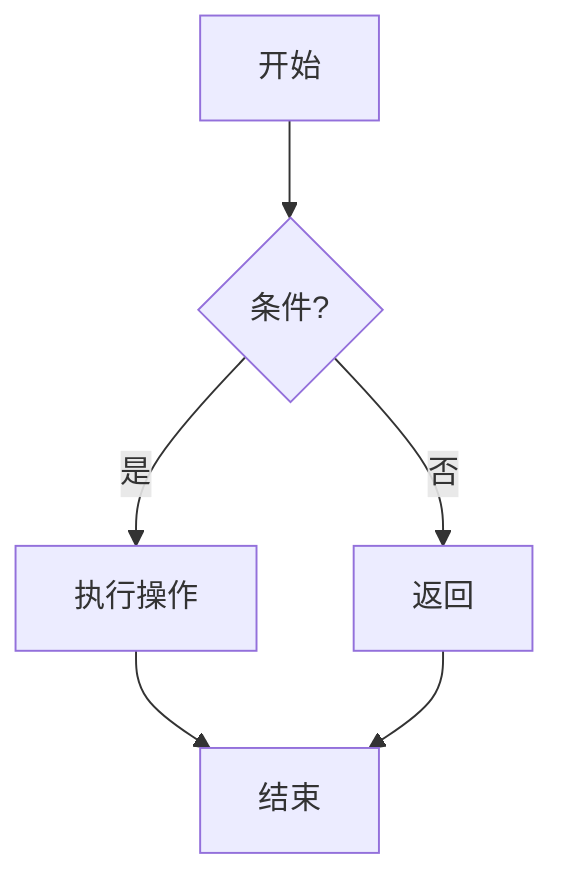

<style>
.columns {
  display: flex;
  gap: 24px;
  align-items: flex-start;
}
.column {
  flex: 1;
  min-width: 0;
}
.column pre {
  margin-top: 0;
}
.column ul,
.column ol {
  margin-top: 0;
}
.column img {
  max-width: 100%;
}
</style>

<!-- _class: lead -->
# Markdown 入门教程

**轻量高效的文本排版之旅**

- 作者：周立杰
- 项目主页：[GitHub](https://github.com/Gentle-Lijie)
- 最后更新：2025 年 10 月

---

## 目录

1. 什么是 Markdown
2. 为什么要学习 Markdown
3. 常见用途
4. 编辑器推荐
5. 基础语法
6. 扩展语法
7. 实践建议
8. 参考与结语

---

## 什么是 Markdown

Markdown 是一种轻量级标记语言，它允许你使用易读易写的纯文本格式编写文档，然后转换成结构化的 HTML 文档。Markdown 由 John Gruber 于 2004 年创建，目标是让人们“使用易读易写的纯文本格式编写文档，然后转换成有效的 HTML 文档”。

---

## 为什么要学习 Markdown

- **排版简单**：专注内容而非格式，让写作更高效
- **笔记干净整洁**：纯文本格式，没有复杂的格式标记
- **一次编写，多处可用**：轻松转换为 HTML、PDF 等格式
- **跨平台轻量展示**：任何文本编辑器都能打开和编辑
- **版本控制友好**：纯文本便于使用 Git 管理历史

---

## 常见用途（1/2）

1. **GitHub README**  
   项目说明、安装使用指南、贡献说明等。
2. **文档说明**  
   技术文档、API 文档、用户手册。
3. **博客撰写**  
   静态博客生成器（Hexo、Jekyll、Hugo 等）。

---

## 常见用途（2/2）

4. **笔记与知识管理**  
   Notion、Obsidian、Typora 等工具均支持 Markdown。
5. **演示文稿**  
   利用 Marp、Reveal.js 等可直接生成幻灯片。

---

## 编辑器推荐 · Typora

- **特点**：所见即所得（WYSIWYG），实时预览
- **适合**：初学者、注重写作体验的用户
- **优势**：界面简洁，支持主题与多格式导出

---

## 编辑器推荐 · VS Code

- **特点**：插件丰富，适合工程化项目
- **适合**：程序员、需要版本控制的用户
- **快捷键**：`Ctrl/Cmd + K` 然后 `V` 打开侧边预览
- **优势**：Git 集成、代码片段、多种扩展

---

## 编辑器推荐 · 其他

- **Obsidian**：个人知识库构建
- **Notion**：协同文档写作
- **在线工具**：StackEdit、Dillinger

---

## 基础语法指南

接下来我们使用两栏布局展示常用语法的“写法 + 效果”，方便对照学习。

---

### 标题

<div class="columns">
<div class="column" markdown="1">

```markdown
# 一级标题
## 二级标题
### 三级标题
#### 四级标题
```

- `#` 数量决定层级
- `#` 后请加空格
- 一级标题通常只用一次

</div>
<div class="column" markdown="1">

# 一级标题
## 二级标题
### 三级标题
#### 四级标题

</div>
</div>

---

### 文本修饰

<div class="columns">
<div class="column" markdown="1">

```markdown
*斜体* 或 _斜体_
**加粗** 或 __加粗__
***粗斜体***
~~删除线~~
<u>下划线</u>
H~2~O / x^2^
==高亮==
```

</div>
<div class="column" markdown="1">

*斜体*  
**加粗**  
***粗斜体***  
~~删除线~~  
<u>下划线</u>  
H~2~O / x^2^  
==高亮==

</div>
</div>

- 粗体用于强调重点，斜体表示术语或引用
- 避免过度使用样式，保持内容简洁

---

### 有序列表与嵌套

<div class="columns">
<div class="column" markdown="1">

```markdown
1. 第一项
2. 第二项
3. 第三项
   1. 子项 1
   2. 子项 2
```

</div>
<div class="column" markdown="1">

1. 第一项
2. 第二项
3. 第三项
   1. 子项 1
   2. 子项 2

</div>
</div>

- 序号不必连续，渲染时会自动排序
- 子列表需缩进两个或四个空格

---

### 无序与任务列表

<div class="columns">
<div class="column" markdown="1">

```markdown
- 项目一
- 项目二
- 项目三

- [ ] 需求确认
- [x] 完成初稿
- [ ] 评审修改
```

</div>
<div class="column" markdown="1">

- 项目一
- 项目二
- 项目三

- [ ] 需求确认
- [x] 完成初稿
- [ ] 评审修改

</div>
</div>

- 适用于任务看板、会议议程、学习计划
- 任务列表在 GitHub Issue/PR 中会转换为复选框

---

### 引用块

<div class="columns">
<div class="column" markdown="1">

```markdown
> 这是引用
>
> - 支持多段
> - 也可嵌套
```

</div>
<div class="column" markdown="1">

> 这是引用
>
> - 支持多段
> - 也可嵌套

</div>
</div>

- 可用于引用原话、总结重点或提示信息

---

### 行内与块级代码

<div class="columns">
<div class="column" markdown="1">

````markdown
`inline code`

```python
print("Hello, World!")
```
````

- 三个反引号包裹代码块
- 指定语言启用语法高亮

</div>
<div class="column" markdown="1">

`inline code`

```python
print("Hello, World!")
```

</div>
</div>

---

### 多语言代码块

<div class="columns">
<div class="column" markdown="1">

````markdown
```python
def hello():
    return "hi"
```

```javascript
const hello = () => "hi";
```
````

</div>
<div class="column" markdown="1">

```python
def hello():
    return "hi"
```

```javascript
const hello = () => "hi";
```

</div>
</div>

- 常用语言标识：`python`, `javascript`, `java`, `c`, `cpp`, `go`, `rust`, `html`, `css`, `json`, `yaml`, `bash`

---

### 表格

<div class="columns">
<div class="column" markdown="1">

```markdown
| 语法 | 描述 |
|------|------|
| `|` | 分隔列 |
| `---` | 分隔表头 |
| `:` | 对齐 |
```

```markdown
| 左 | 中 | 右 |
|:---|:--:|---:|
| 1  | 2  | 3  |
```

</div>
<div class="column" markdown="1">

| 语法 | 描述 |
|------|------|
| `|` | 分隔列 |
| `---` | 分隔表头 |
| `:` | 对齐 |

| 左 | 中 | 右 |
|:---|:--:|---:|
| 1  | 2  | 3  |

</div>
</div>

- 表格适用于对比数据、列出参数
- Typora 等工具提供可视化表格编辑

---

### 链接与图片

<div class="columns">
<div class="column" markdown="1">

```markdown
[链接文本](https://example.com)


<https://example.com>
```

- 链接可添加标题 `[文本](URL "Title")`
- 图片请提供有意义的 Alt 文本
- 大图可控制宽度，如 `{ width=60% }`

</div>
<div class="column" markdown="1">

[链接文本](https://github.com/Gentle-Lijie)


<https://example.com>

</div>
</div>

---

### 脚注

<div class="columns">
<div class="column" markdown="1">

```markdown
文本示例[^1]，再加一个[^note]。

[^1]: 第一个脚注。
[^note]: 另一个脚注。
```

- 适合补充说明或引用来源
- 多数平台会把脚注收集到底部

</div>
<div class="column" markdown="1">

文本示例[^1]，再加一个[^note]。

[^1]: 第一个脚注。
[^note]: 另一个脚注。

</div>
</div>

---

## 扩展语法概览

部分平台支持的高级语法：数学公式、Mermaid 流程图、自动目录等。使用前请确认目标环境是否兼容。

---

### 数学公式

<div class="columns">
<div class="column" markdown="1">

```markdown
行内：$E=mc^2$

块级：
$$
x_{1,2} = \frac{-b \pm \sqrt{b^2-4ac}}{2a}
$$
```

</div>
<div class="column" markdown="1">

行内：$E=mc^2$

块级：
$$
x_{1,2} = \frac{-b \pm \sqrt{b^2-4ac}}{2a}
$$

</div>
</div>

- 需编辑器或渲染器支持 LaTeX（Typora、VS Code 插件、GitHub 等）

---

### Mermaid 流程图

<div class="columns">
<div class="column" markdown="1">

````markdown

````

</div>
<div class="column" markdown="1">


</div>
</div>

- GitHub、Typora、Obsidian、VS Code（插件）支持良好

---

### 自动目录（TOC）

<div class="columns">
<div class="column" markdown="1">

```markdown
[TOC]

[[toc]]
```

- 语法因平台而异
- 可快速生成文档导航

</div>
<div class="column" markdown="1">

许多编辑器会根据标题自动插入目录，例如 Typora、VuePress、GitHub Pages（需配置）。

</div>
</div>

---

## 实践建议 · 动手练习

- 新建一个 `.md` 文件边学边写
- 尝试复现示例中的各类语法
- 使用 Markdown Lint 或 Prettier 保持风格一致

---

### 回文判断示例

<div class="columns">
<div class="column" markdown="1">

```python
def is_palindrome(s):
    s = s.lower().replace(' ', '')
    return s == s[::-1]
```

```python
print(is_palindrome("Level"))
print(is_palindrome("Hello"))
print(is_palindrome("A man a plan a canal Panama"))
```

</div>
<div class="column" markdown="1">

任务清单：
- [x] 处理大小写
- [x] 移除空格
- [x] 使用切片反转字符串
- [ ] 处理标点（可选）

技巧总结：
- 先做文本预处理
- 用切片 `[::-1]` 快速反转
- 边写边跑示例，确保结果正确

</div>
</div>

---

## 最佳实践

- **保持简洁**：不要过度堆叠样式
- **语义优先**：正确使用标题、列表等结构
- **一致性**：在同一文档中保持统一风格
- **可读性**：即使纯文本也应易读
- **版本控制**：利用 Git 记录变更、协作审阅

---

## 参考资源

- [Markdown 官方教程](https://www.markdownguide.org/)
- [GitHub Flavored Markdown](https://github.github.com/gfm/)
- [CommonMark 规范](https://commonmark.org/)
- [Marp 官方文档](https://marp.app/)

---

## 结语

Markdown 让你聚焦内容创作，不受复杂排版工具束缚。无论是程序员、学生还是知识工作者，它都能成为提升效率的得力助手。现在就打开编辑器，写下你的第一篇 Markdown 笔记吧！

