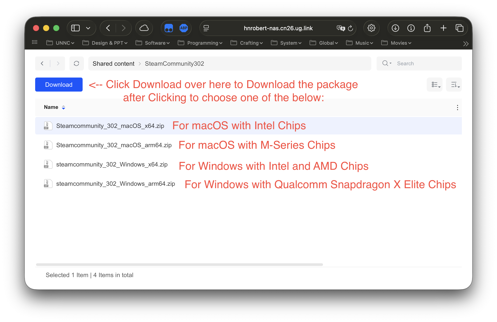
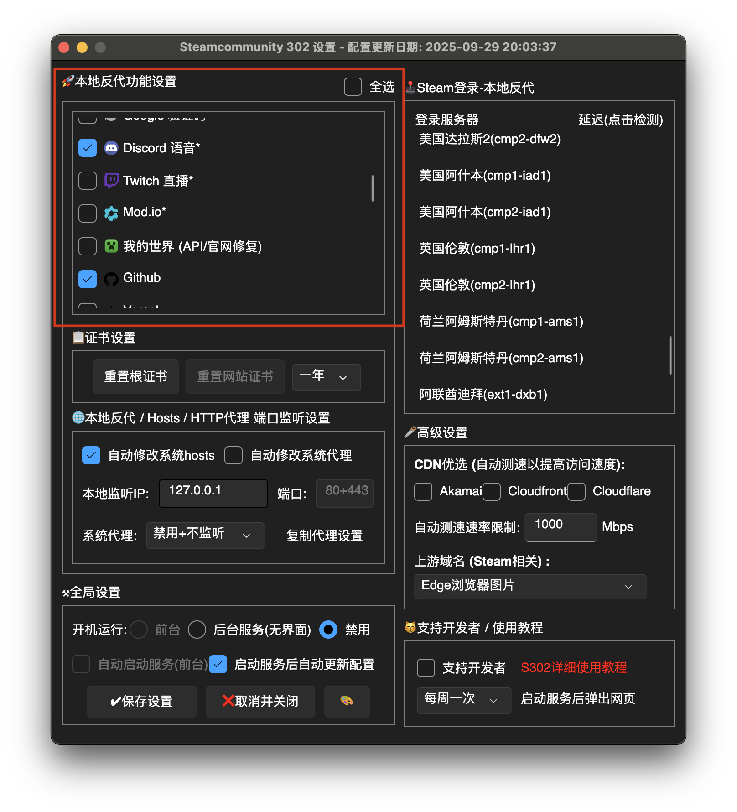

# Show your coding status on Discord with a simple VSCode plugin

This workshop will guide you through the steps to connect Visual Studio Code (VSCode) with Discord using a plugin, allowing you to display your coding activity as a rich presence status on your Discord profile.

## Required Preparation

[Click to Download VSCode installer](https://code.visualstudio.com) [Click to Download Discord installer and SteamCommunity](http://ug.link/hnrobert-nas/filemgr/share-download/?id=b80a41b4bd604b80945dcde6bde1d9c3)

- Just download the installers/packages that match your own computer's platform/architecture.
- **If you've already known how to connect to Discord under domestic network environment, you may skip the installation of SteamCommunity**, otherwise please have it prepared, and we will introduce more about its usage during the session
- If you are still not sure about how to set up the Proxy using SteamCommunity, please follow the steps in the [Background Knowledge](#usage-of-steamcommunity-as-a-proxy-provider) section below during the session.

## Background Knowledge

Discord is a popular communication platform among gamers and developers. It allows users to create servers, join communities, and communicate via text, voice, and video. One of its features is the ability to display rich presence status, which shows what a user is currently doing in supported applications. About how nice Discord is, we may introduce more about it after solving today's first issue - network.

It may not be difficult for you to notice that, after downloading the installer of Discord and installing it locally, when you're trying to connect to the Discord server, you may face the first issue in our today's session: **it may fail to connect under domestic network environment**. This is because Discord do not provide their service in some regions, and users may need to use a proxy service to access it.

### What is **Proxy Service**?

A **Proxy Service** is a service that allows users to connect to the internet through a server located in a different region or country. This can help bypass regional restrictions and access blocked content.

- Normally if you want to access a website, the diagram below shows how it works without Proxy:

  ```mermaid
  graph TD;
      User[User] -->|Request| Website[Website Server]
      Website -->|Response| User
  ```

- But when you don't have access to a specific website directly but a server located in one place can reach both you and the website you want to visit, you may use this server as a Proxy server. Now you're using a Proxy, and the diagram changes to:

  ```mermaid
  graph TD;
      User -->|Request| Proxy[Proxy Server]
      Proxy -->|Request| Website[Website Server]
      Website -->|Response| Proxy
      Proxy -->|Response| User
  ```

For example, now, through using a Proxy, you can route your internet traffic toward Discord through a server in a location where Discord is accessible, allowing them to connect to the Discord servers without issues.

Usually, there are many Proxy service providers available, both free and paid, legal and illegal. In this session, we will not recommend any specific Proxy service provider, but we will introduce a method to set up a Proxy using `SteamCommunity`, which is a legal and free option for users in domestic network environments.

### Usage of SteamCommunity as a Proxy Provider

SteamCommunity is a platform for gamers to connect and share content. It also provides a built-in proxy service that can be used to access blocked websites, including Discord.

> Meanwhile, not only Discord app, SteamCommunity can provide proxy service for other applications as well, such as web browsers, game launchers, etc.  
> Any application that sends internet traffic can potentially benefit from using SteamCommunity as a proxy, as long as SteamCommunity supports.

1. Download the zip package of SteamCommunity from [the link above](http://ug.link/hnrobert-nas/filemgr/share-download/?id=b80a41b4bd604b80945dcde6bde1d9c3)
   
2. Extract the zip package to a local directory on your computer (to a location that is easy to remember, this is recommended). The default decompressor of your operating system should be fine.
3. Run the Programme
   - On Windows, double-click the `Steamcommunity_302.exe` file to launch the application. If any security warnings appear, confirm that you want to run the application.
   - On macOS or Linux, open a terminal, navigate to the extracted directory, and open the `运行.command` file using the `Terminal` app (which should be done so by default, so just double click and open would just be fine).
     - macOS has a security mechanism called Gatekeeper that may block applications from unidentified developers. If you encounter a warning when trying to run SteamCommunity, like this:
       

       you can bypass this by following these steps:
       1. Open `System Preferences` and go to `Security & Privacy`.
       2. In the `General` tab, you should see a message about SteamCommunity being blocked. Click the `Open Anyway` button.
       3. Confirm your choice in the dialog that appears.
4. After launching SteamCommunity, you may see its main interface as shown below, now Click the `⚙️设置` button to open the settings panel.
   
5. Select the website/application you want to use the proxy for (in this case, just select `Discord 语音` would be fine, you may also notice a Option called `GitHub`, that can also be helpful for you ;).
   
6. Set your proxy server location by selecting a server from the `登录服务器` dropdown menu. Choose a server that is closer to you, meanwhile, where Discord is accessible, like Singapore or Japan, and Hong Kong may also be fine.
   
7. Save your config using the button at the left-bottom corner, called `保存设置`, and you may return to the main interface and click the `启动服务` button to start the proxy service. If you see "服务已启动" message, that means the proxy service is running now.
   

### Why Discord?

Discord is widely used among developers and gamers for communication and collaboration. But why not other communication platforms like Slack or Microsoft Teams?

TODO

## Steps to Connect VSCode with Discord

### Discord Setup

1. Make sure you have Discord installed on your computer and that you are logged into your account.
2. Open Discord and go to User Settings by clicking on the gear icon located at the bottom left corner of the Discord window.
3. In User Settings, navigate to the "Activity Status" tab on the left sidebar.
4. Ensure that the "Display current activity as a status message" option is enabled. This allows Discord to show your current activity, including VSCode usage.

### VSCode Setup

1. Install Visual Studio Code (VSCode) on your computer if you haven't already.
2. Open VSCode and navigate to the Extensions view by clicking on the Extensions icon in the Activity Bar on the side of the window or by pressing `Ctrl+Shift+X`.
3. In the search bar, type "Discord Presence" to find the Discord Presence extension.
4. Click on the "Install" button to install the Discord Presence extension.
5. After installation, you may need to restart VSCode to activate the extension.
6. Once VSCode is restarted, the Discord Presence extension should automatically connect to your Discord account.
7. Open a project or start coding in VSCode, and you should see your coding activity displayed as a rich presence status on your Discord profile.
8. You can customize the settings of the Discord Presence extension by going to the Extensions view, finding the Discord Presence extension, and clicking on the gear icon to access its settings.
9. In the settings, you can configure options such as showing the file name, programming language, and time spent coding.
10. Enjoy sharing your coding status with your friends on Discord!

For more detailed instructions and troubleshooting, refer to the [official documentation of the Discord Presence extension](https://marketplace.visualstudio.com/items?itemName=icrawl.discord-vscode).
