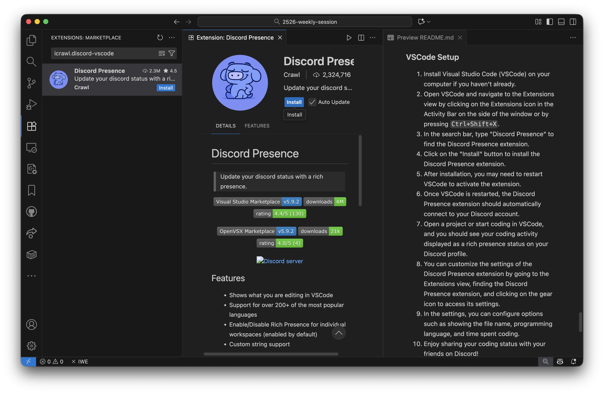

# 通过代理、Webhook 和简单的 VSCode 插件在 Discord 上展示你的 Coding 状态

本次工作坊将引导你完成使用代理、Webhook 和 VSCode 插件连接 Visual Studio Code（VSCode）与 Discord 的步骤，让你能够将编码活动作为丰富的在线状态显示在你的 Discord 个人资料上，并与开发者社区保持联系。


## 所需准备

[点击下载 **VSCode 安装包**](https://code.visualstudio.com) 以及 [点击下载 **Discord 安装包** 和 **SteamCommunity**](http://ug.link/hnrobert-nas/filemgr/share-download/?id=b80a41b4bd604b80945dcde6bde1d9c3)

- 只需下载与你的笔记本平台/架构匹配的安装包即可。
- **如果你已经知道如何在国内网络环境下连接 Discord，可以跳过 SteamCommunity 的安装**，否则请准备好它，我们将在课程中介绍更多关于它的使用方法。
- 如果你仍然不确定如何使用 SteamCommunity 设置代理，请在课程期间按照下面[背景知识](#steamcommunity-作为代理服务提供者的使用方法)部分的步骤操作。

## 背景知识

Discord 是一个在游戏玩家和开发者中广受欢迎的在线交流平台。它允许用户创建服务器、加入社区，并通过文本、语音和视频进行交流。它的一个功能是能够显示丰富的在线状态，展示用户当前在支持的应用程序中正在做什么。关于 Discord 有多好以及我们为什么要介绍它，我们可能会在解决今天在座各位可能会碰到的第一个网络相关的问题之后，来介绍更多。

你可能不难注意到，在下载 Discord 安装包并在本地安装后，当你尝试连接到 Discord 服务器时，可能会遇到我们今天课程的第一个问题：**在国内网络环境下可能无法连接**。这是因为 Discord 在某些地区不提供服务，用户可能需要使用代理服务来访问它。

### 什么是**代理服务**？

**代理服务**是一种「允许用户通过一个用户可以直接访问的代理服务器，连接到另一个可能用户无法直接访问的网络服务」的一种服务。这可以帮助绕过地区限制并访问被封锁的内容。

- 通常，如果你想访问一个网站，下图显示了在正常情况下的流程：

  ```mermaid
  graph TD;
      User[用户] -->|请求| Website[网站服务器]
      Website -->|响应| User
  ```

- 但是，当你无法直接访问特定网站，但某个位置的服务器可以同时访问 「你」和「你想访问的网站」时，你可以使用该服务器作为代理服务器。现在你正在使用代理，图表变为：

  ```mermaid
  graph TD;
      User[用户] -->|请求| Proxy[代理服务器]
      Proxy -->|请求| Website[网站服务器]
      Website -->|响应| Proxy
      Proxy -->|响应| User
  ```

例如，现在通过使用代理，你可以通过位于 Discord 可访问位置的服务器将你的互联网流量路由到 Discord，使他们能够畅通地连接到 Discord 服务器。

通常，有许多代理服务提供商可用，既有免费的也有付费的，既有合法的也有非法的。在本次课程中，我们不会推荐任何特定的代理服务提供商，但我们将介绍一种使用 `SteamCommunity` 作为代理的方法，这对于国内网络环境的用户来说是一个合法且免费的选择。

### SteamCommunity 作为代理服务提供者的使用方法

SteamCommunity 是一个供玩家连接和分享内容的平台。它还提供了一个内置的代理服务，可用于访问被封锁的网站，包括 Discord。

> 同时，不仅是 Discord 应用，SteamCommunity 还可以为其他应用程序提供代理服务，例如网页浏览器、游戏启动器等。  
> 任何发送互联网流量的应用程序都有可能从使用 SteamCommunity 作为代理中受益，只要 SteamCommunity 支持。

1. 从[上面的链接](http://ug.link/hnrobert-nas/filemgr/share-download/?id=b80a41b4bd604b80945dcde6bde1d9c3)下载 SteamCommunity 的 zip 压缩包。只需进入文件夹，然后选择一个与你的操作系统匹配的版本然后点击下载按钮即可。
   
2. 将 zip 压缩包解压到计算机上的本地目录（建议解压到一个容易记住的位置）。使用你操作系统的默认解压工具即可。
3. 运行程序

   - 在 Windows 上，双击 `Steamcommunity_302.exe` 文件以启动应用程序。如果出现任何安全警告，请选择确认你要运行该应用程序即可。
   - 在 macOS 或 Linux 上，打开终端，导航到解压的目录，然后使用 `Terminal` 应用打开 `运行.command` 文件（默认情况下应该这样做，所以只需双击打开即可）。

     - macOS 有一个称为 Gatekeeper 的安全机制，可能会阻止来自未识别开发者的应用程序。如果你在尝试运行 SteamCommunity 时遇到警告，如下所示：
       

       你可以通过以下步骤绕过此问题：

       1. 打开 `系统偏好设置` 并进入 `安全性与隐私`。
       2. 在 `通用` 选项卡中，你应该会看到关于 SteamCommunity 被阻止的消息。点击 `仍要打开` 按钮。
       3. 在出现的对话框中确认你的选择。

4. 启动 SteamCommunity 后，你可能会看到如下所示的主界面，现在点击 `⚙️设置` 按钮打开设置面板。
   
5. 选择你想要使用代理的网站/应用程序（在这种情况下，只需选择 `Discord 语音` 即可，你也可能注意到一个名为 `GitHub` 的选项，这对你也很有帮助 ;)。
   
6. 通过从 `登录服务器` 下拉菜单中选择服务器来设置你的代理服务器位置。选择一个离你较近的服务器，同时该服务器所在位置可以访问 Discord，比如新加坡或日本，香港也可以。
   
7. 使用左下角的 `保存设置` 按钮保存你的配置，然后你可以返回主界面并点击 `启动服务` 按钮以启动代理服务。如果你看到"服务已启动"消息，这意味着代理服务现在正在运行。
   

### 为什么选择 Discord？

Discord 在开发者和游戏玩家中广泛用于交流和协作。但为什么不选择其他通讯平台，如微信或 Microsoft Teams 呢？

- **开发者社区**：Discord 拥有庞大且活跃的开发者社区，这导致了各种插件和扩展的创建，增强了其功能，包括用于 VSCode 的 Discord Presence 扩展。更重要的是，Discord 对开发者开放支持，允许他们使用 Discord API 创建自己的应用程序和集成，并以编程方式与 Discord 平台交互。Discord 还支持机器人，可以自动化任务并在服务器中提供额外功能。
- **易用性**：Discord 以其用户友好的界面和易用性而闻名，使初学者和有经验的用户都能轻松使用。
- **Rich Presence 功能**：Discord 的 Rich Presence 功能允许用户显示有关其当前活动的详细信息，例如他们正在处理的文件、正在使用的编程语言以及编码所花费的时间。这个功能在其他通讯平台中并不常见。


#### Discord 账户的注册和设置

> 首先，请确保你已完成上面[SteamCommunity 作为代理服务提供者的使用方法](#steamcommunity-作为代理服务提供者的使用方法)部分的步骤，以便你可以无问题地访问 Discord。

1. 如果你还没有 Discord 账户，请访问 [Discord 注册页面](https://discord.com/register)，使用你自己的电子邮件地址或学校电子邮件注册一个新账户。只需按照页面上的说明完成注册过程。
2. 注册后，从 [Discord 下载页面](https://discord.com/download)下载并安装 Discord 应用程序到你的计算机。
3. 启动 Discord 应用程序并使用你新创建的账户凭据登录。

## 体验 Discord Presence 扩展和 GitHub 集成

1. 确保你已按照上述步骤设置 Discord 和 SteamCommunity 代理服务。
2. 在你的计算机上启动 Discord，并尝试通过左侧的添加按钮加入一个 [Discord 服务器（右键我并复制链接）](https://discord.com/invite/5dVbWhEbQc)，点击下面的 `加入 Discord 服务器` 按钮，然后粘贴你复制的邀请链接：
   

   你也可以直接在网页浏览器中访问上面的链接，确保你使用的是刚刚注册的账户或你一直在使用的账户，然后让它重定向到你的 Discord 应用以加入服务器。

3. 在服务器中，你可以看到 Rich Presence 状态的示例（我的），并浏览添加了 GitHub Bot 的 `#github` 频道，看看它是如何工作的。
4. 尝试在 GitHub 上为[此仓库](https://github.com/CompPsyUnion/2526-weekly-session)点星，并查看 Discord 中的 GitHub Bot 如何通知服务器你的操作。
   

   **效果：**

   

> Webhook 是应用程序之间实时通信的一种方式。在 Discord 和 GitHub 的上下文中，可以设置 Webhook Bot 在 GitHub 仓库发生某些事件时向 Discord 频道发送通知，例如新提交、拉取请求或问题。  
> Webhook 就像一个应用程序对另一个应用程序做出的承诺，说"嘿，当这件事发生时，我会通过发送消息通知你。"在这种情况下，GitHub 承诺在仓库中发生重要事情时通知 Discord。
>
> 我们可能会在**未来的课程**中更多地介绍如何为 GitHub 设置 Discord Webhook Bot，甚至 Webhook 技术的一些进一步用法。

## 连接 VSCode 与 Discord 的步骤

### Discord 和代理设置

1. 确保你的计算机上已安装 Discord 并且你已登录到你的账户。
2. 请确保 SteamCommunity 或你自己的类似代理服务正在运行，如上面[SteamCommunity 作为代理服务提供者的使用方法](#steamcommunity-作为代理服务提供者的使用方法)部分所述。

### VSCode 设置

1. 如果你还没有安装 Visual Studio Code（VSCode），请先在你的计算机上安装它。
2. 打开 VSCode 并导航到扩展视图，方法是点击窗口侧边活动栏中的扩展图标，或按 `Ctrl+Shift+X`。
3. 在搜索栏中，输入 "Discord Presence" 或使用插件 ID `icrawl.discord-vscode` 来查找 Discord Presence 扩展。
   
4. 点击"安装"按钮以安装 Discord Presence 扩展。
5. 安装后，Discord Presence 扩展应自动连接到你的 Discord 账户，查看下面的徽章：
   

   如果它显示"**重新连接到 Discord**"，只需点击它以重新连接。如果它仍然无法连接，请查看下面的清单并在确认所有项目都满足后重试：

   - **Discord 应用**正在你的计算机上运行，并且你已登录。
   - SteamCommunity 代理服务正在运行（如果适用）。

6. 在 VSCode 中打开一个项目或一个文件开始写代码，你应该会看到你的编码活动作为 Rich Presence 状态显示在你的 Discord 个人资料上。
   
7. 你可以通过进入扩展视图、找到 Discord Presence 扩展并点击齿轮图标来访问其设置，以自定义 Discord Presence 扩展的设置。
8. 在设置中，你可以配置选项，例如显示文件名、编程语言和编码所花费的时间。
9. 享受与 Discord 上的朋友分享你的编码状态吧！

有关更详细的说明和故障排除，请参阅 [Discord Presence 扩展的官方文档](https://marketplace.visualstudio.com/items?itemName=icrawl.discord-vscode)。
