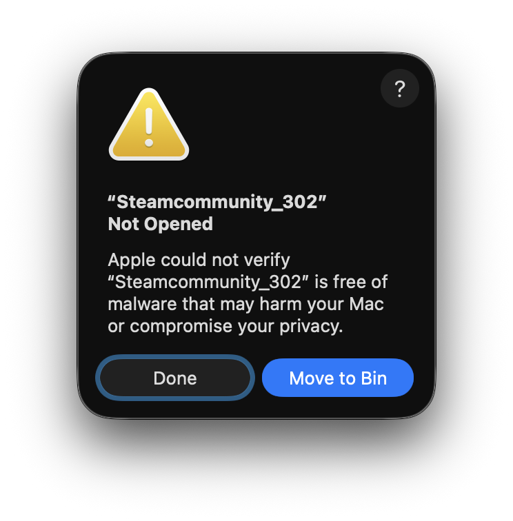
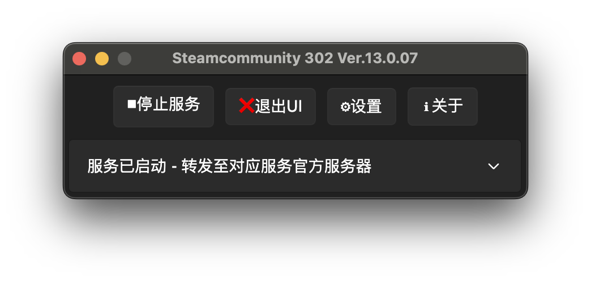

<!-- _class: lead -->

# VSCode & Discord Integration

**Show Your Coding Status on Discord**

_Displaying Your Coding Activities on Discord via Proxy, Webhook, and VSCode Extension_

---

## Workshop Objectives

This workshop will guide you through:

- Connecting to Discord using a proxy service
- Displaying your coding activities on Discord
- Understanding webhook applications in developer communities
- Experiencing GitHub and Discord integration

---

## Required Preparation

**Download the following software:**

1. [**VSCode Installer**](https://code.visualstudio.com)
2. [**Discord Installer** and **SteamCommunity**](http://ug.link/hnrobert-nas/filemgr/share-download/?id=b80a41b4bd604b80945dcde6bde1d9c3)

**Important Notes:**

- Select the installer matching your computer's platform/architecture
- If you already know how to connect to Discord in mainland China, you may skip SteamCommunity installation
- If unsure about proxy setup, please continue reading the next section

---

## Background Knowledge · Introduction to Discord

**What is Discord?**

Discord is a communication platform widely used amongst gamers and developers:

- Supports text, voice, and video communication
- Create servers and join communities
- **Rich Presence** feature displays user's current activity status
- Friendly for **Webhook and Bots**

---

## **First Issue Encountered:** Discord may fail to connect in mainland China network environment

## **Solution:** **Use a proxy service**

---

## What is a Proxy Service?

A **proxy service** allows users to connect to the internet through a server located in a different region or country.

**Without Proxy:**

<pre class="mermaid">
graph TD;
    User[User] -->|Request| Website[Website Server]
    Website -->|Response| User
</pre>

---

**With Proxy:**

<pre class="mermaid">
graph TD;
    User[User] -->|Request| Proxy[Proxy Server]
    Proxy -->|Request| Website[Website Server]
    Website -->|Response| Proxy
    Proxy -->|Response| User
</pre>

Through a proxy, you can access restricted content, including Discord!

---

## SteamCommunity as a Proxy Provider

**Why Choose SteamCommunity?**

- Legal and free
- Suitable for mainland China network environment
- Supports not only Discord but also other applications

**Supported Applications:**

- Discord & Steam & GitHub
- And more...

(If you have other proxy solutions, you may ignore the SteamCommunity setup steps)

---

## Setting Up SteamCommunity (Step 1)

**1. Download SteamCommunity**

Select the version suitable for your operating system from the [download link](http://ug.link/hnrobert-nas/filemgr/share-download/?id=b80a41b4bd604b80945dcde6bde1d9c3)

---

## Setting Up SteamCommunity (Steps 2-3)

**2. Extract**

Extract the zip package to a local directory that's easy to remember

**3. Run the Programme**

- **Windows**: Double-click the `Steamcommunity_302.exe` file
- **macOS/Linux**: Double-click the `运行.command` file

---

## macOS Security Notice

**If you encounter a security warning on macOS:**

**Solution:**

1. Open `System Preferences` → `Security & Privacy`
2. In the `Security` tab, click the `Open Anyway` button
3. Confirm your choice in the dialogue box

---

## Setting Up SteamCommunity (Step 4)

**4. Open Settings**

After launching, click the `设置` button

---

## Setting Up SteamCommunity (Step 5)

**5. Select Applications to Proxy**

Select `Discord 语音` (you may also select `GitHub` simultaneously)

---

## Setting Up SteamCommunity (Step 6)

**6. Select Proxy Server Location**

Select a server from the `登录服务器` drop-down menu. Recommended:

**Recommended Locations:**

- Singapore
- Japan
- Hong Kong

---

## Setting Up SteamCommunity (Step 7)

**7. Save and Start Service**

- Click the `保存设置` button in the bottom-left corner and return to the main interface
- Click the `启动服务` button
- Seeing "服务已启动" message indicates success

---

## Why Choose Discord?

**Advantages Compared to Other Communication Platforms:**

**Developer Community**

- Large and active developer community
- Open API support
- Rich plugins and extensions
- Bot automation support

---

**Ease of Use**

- User-friendly interface
- Accessible to both beginners and experts

**Rich Presence Feature**

- Displays detailed activity information
- Shows the file being edited
- Displays programming language and coding duration

---

## Discord Account Registration and Setup

**Prerequisite:** Ensure SteamCommunity proxy service is running

**Steps:**

1. Visit the [Discord registration page](https://discord.com/register)
2. Register a new account using your email address
3. Download the application from the [Discord download page](https://discord.com/download)
4. Install and launch the Discord application
5. Log in using your newly created account

---

## Experience Discord Presence Extension

**Join the Example Server:**

1. Ensure SteamCommunity service is running then Launch Discord
2. Click `Join a Server` button on the pop up
3. Paste the invite link (see GitHub doc)
4. Click `Join Server`

---

## Experience GitHub Integration

**In the Server:**

1. View `HNRobert`'s Rich Presence status examples
2. Browse the `#github` channel to see how the GitHub Bot works
3. Star [this repository](https://github.com/CompPsyUnion/2526-weekly-session)

---

## GitHub Bot Effect Demonstration

When you star the repository, the GitHub Bot in Discord will notify the server:

---

## What is a Webhook?

A **webhook** is a method for real-time communication between applications.

**How It Works:**

- One application makes a "promise" to another application
  - GitHub: "Hey, when this happens, I'll send you a message to notify you"
  - Sends notifications to Discord when important events occur in the repository

**Supported Events in Discord:**

- New commits, Pull Requests, Issues, Stars, And more...

We will cover webhook setup and usage in depth in future sessions!

---

## Connecting VSCode with Discord (Preparation)

**Discord and Proxy Setup:**

Discord is installed and logged in
SteamCommunity proxy service is running (if applicable)

**Now let's set up VSCode!**

---

## VSCode Setup (Steps 1-2)

**1. Install & open VSCode**

If not already installed, please install Visual Studio Code first

**2. Open Extensions View**

- Click the Extensions icon in the sidebar
- Or press `Ctrl+Shift+X` (Windows/Linux)
- Or press `Cmd+Shift+X` (macOS)

---

## VSCode Setup (Step 3 - 4)

**3-4. Search for Extension, and click `Install`**

Enter "Discord Presence" in the search bar or use the ID: `icrawl.discord-vscode`

---

## VSCode Setup (Step 5)

**5. Automatic Connection**

After installation, the extension will automatically connect to your Discord account

---

## Connection Troubleshooting

**If it displays "Reconnect to Discord":**

- Click the badge to reconnect
- Checklist:
  - Discord application is running and logged in
  - SteamCommunity proxy service is running (if applicable)

---

## View the Effect

**6. Start Coding**

Open a project or start coding, and your coding activity will be displayed on your Discord profile!

---

## Customise Settings

**7. Configure Extension Options**

- Go to Extensions view
- Find the Discord Presence extension
- Click the gear icon to access settings

**Configurable Options:**

- Display filename & programming language
- Display coding duration
- Customise status text, and more...

---

## Troubleshooting

**Connection Failed? Check the Following:**

1. Discord application is running and logged in
2. SteamCommunity proxy service is running (mainland China users)
3. VSCode Discord Presence extension is properly installed
4. "Activity Status" is enabled in Discord settings

**Still Having Issues?**

- Restart the Discord application & Restart VSCode
- Refer to the [official documentation](https://marketplace.visualstudio.com/items?itemName=icrawl.discord-vscode)

---

## Session Summary

**Today We Learnt:**

1. What a proxy service is and why we need it
2. How to set up a proxy using SteamCommunity
3. Discord's features and advantages
4. How to register and set up a Discord account
5. What webhooks are and their applications
6. How to install and configure the Discord Presence extension
7. Displaying your coding status on Discord

---

## Further Exploration

**Next Steps to Try:**

- Explore advanced settings of the Discord Presence extension
- Create your own Discord bot
- Set up webhooks for your GitHub repositories
- Join more developer Discord communities
- Learn Discord API development

---

**Future Session Preview:**

- In-depth webhook technology coverage
- Introduction to Discord bot development
- GitHub Actions and automated workflows

---

<!-- _class: lead -->

# Thank You

**Start Sharing Your Coding Status on Discord!**

Questions? Feel free to ask during the session or discuss in our Discord server

---

## Reference Resources

**Official Documentation:**

- [Discord Presence Extension](https://marketplace.visualstudio.com/items?itemName=icrawl.discord-vscode)
- [Discord Developer Documentation](https://discord.com/developers/docs)
- [VSCode Extension Documentation](https://code.visualstudio.com/api)

**Related Links:**

- [This Session Repository](https://github.com/CompPsyUnion/2526-weekly-session)
- [Discord Download](https://discord.com/download)
- [VSCode Download](https://code.visualstudio.com)
